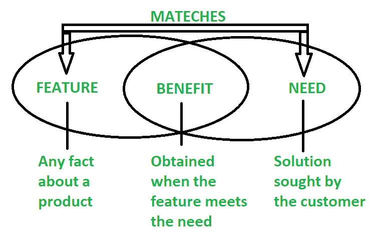

# 特性和优点的区别

> 原文:[https://www . geesforgeks . org/特色与优势的区别/](https://www.geeksforgeeks.org/difference-between-features-and-benefits/)

**1。特色:**
关于产品或服务所做或能做的陈述。特色带来优势。它定义了产品的不同方面。它可以是技术性的或描述性的。主要功能是优势的基础，因此目标是改进产品或服务中尽可能多的功能。

例如**你正在购买一部智能手机，它有互联网连接设施。意思是指智能手机的一个功能。另一个特点可能是该设备有 64 mp 摄像头。**

**再举一个**例子**可以假设一个产品是水基的，无毒且不易燃。**

****2。优势:**
它展示的是产品或服务能为用户完成的最终结果。优势带来好处。它指的是顾客使用它时，他们的生活是如何改善的。因此，优势取决于特性意味着包含的特性越多，我们从产品或服务中获得的优势就越多。**

**例如**如果你带了一部有互联网连接功能的手机，那么你可以很容易地使用[互联网](https://www.geeksforgeeks.org/the-internet-and-the-web/)参加在线课程。拥有一个好的相机，你可以从设备中获得的另一个好处是，你可以捕捉生活中的每一刻，并将其存储在手机中。****

****再举一个**的例子**可以是具有水基、无毒和不易燃特性的产品，我们可以获得的好处是它在工作场所是环境友好和健康的。****

****下图**为特征-需求-利益关系:******

********

 ******特色与优势的区别:******

| 没有。 | 特征 | 利益 |
| 01. | 特性定义了产品的不同方面。它可以是技术性的或描述性的。 | 好处是指使用时生活的改善。 |
| 02. | 特征是你产品的物理特征，特征是你要卖的东西。 | 好处就是顾客为什么会有购买人的好感。 |
| 03. | 简单地说，功能告诉客户什么。 | 简单的好处告诉客户为什么。 |
| 04. | 特色是指你的产品或服务是什么，它包括什么，它是如何制造的。 | 好处是指客户使用它时，他们的生活得到了改善。 |
| 05. | 我们可以说一个特征就是某物是什么。 | 我们可以说，利益是一件事情的结果。 |
| 06. | 它是从关于产品或服务的事实中获得的。 | 当特征满足需要时获得。 |
| 07. | 功能对用户前景几乎没有情感影响。 | 利益对用户的前景几乎有情感上的影响。 |
| 08. | 特色带来优势。 | 优势带来好处。 |
| 09. | 例如，笔记本电脑配备了 512 GB 固态硬盘和 1 TB 硬盘。 | 例如，配备 512 GB 固态硬盘和 1 TB 硬盘的笔记本电脑将更快，并且可以轻松快速地执行不同的任务。 |

