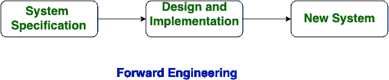
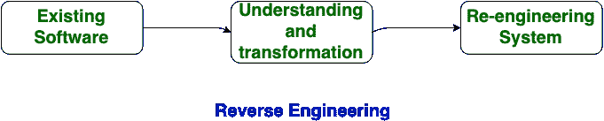

# 正向工程和逆向工程的区别

> 原文:[https://www . geesforgeks . org/正向工程和反向工程的区别/](https://www.geeksforgeeks.org/difference-between-forward-engineering-and-reverse-engineering/)

### **正向工程:**

正向工程是一种在给定需求的帮助下创建或制作应用程序的方法。远期工程也称为改造和复垦。前沿工程需要高熟练技能。构建或开发一个应用程序需要更多的时间。向前工程是一种创建高级模型或设计的技术，以利用复杂性和低级信息。 因此这种工程在众多的包和信息流程中有着完全不同的原理。正向工程应用于所有包含软件开发生命周期的软件工程过程，以重新创建相关的现有应用程序。 即将全面填补用户的新需求，进入再工程。

### 特征前进工程:

1.  正向工程是在众多的包和信息过程中具有不同原理的多种工程。
2.  向前工程在信息技术中至关重要，因为它代表了‘正常’的开发过程。
3.  正向工程处理业务流程、服务、和功能到应用的转换。
4.  在这种方法中，首先开发商业模型。然后，采用自上而下的方法，促使从开发的模型中提取包。
5.  正向工程工具习惯于从实现风格和逻辑转移到供应代码事件。
6.  它本质上允许用户开发一个业务模型，然后可以将其转化为数据系统组件。
7.  These tools basically follow the top-to down approach. System creator and visual Analyst is a forward engineering CASE tool.

### 

**逆向工程:**

逆向工程又称逆向工程，是在逆向中进行正向工程的过程。在这种情况下，信息是从给定的或现有的应用程序中收集的。开发一个应用程序比正向工程花费的时间少。在逆向工程中，应用程序被分解以提取知识或其体系结构。

**正向工程和逆向工程的区别:**

<figure class="table">

| S.NO | 前沿工程 | 逆向工程 |
| 1. | 在正向工程中，应用程序是按照给定的要求开发的。 | 在逆向工程或逆向工程中，信息是从给定的应用程序中收集的。 |
| 2. | 前沿工程是一项高度熟练的技能。 | 逆向工程或逆向工程是一种低熟练技能。 |
| 3. | 正向工程需要更多的时间来开发应用程序。 | 而逆向工程或逆向工程开发应用程序花费的时间更少。 |
| 4. | 正向工程的本质是规定性的。 | 逆向工程或逆向工程的本质是自适应的。 |
| 5. | 在正向工程中，生产是按照给定的要求开始的。 | 在逆向工程中，生产是从产品的现有产品开始的。 |
| 6. | 正向工程的例子是电子套件的建设、DC 汽车的建设等。 | 逆向工程的一个例子是仪器研究等。 |

</figure>