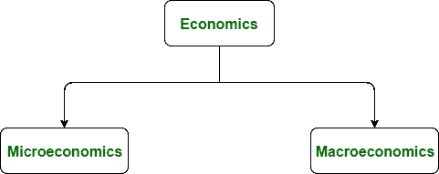

# 微观经济学和宏观经济学的区别

> 原文:[https://www . geesforgeks . org/微观经济学和宏观经济学的区别/](https://www.geeksforgeeks.org/difference-between-microeconomics-and-macroeconomics/)

**微观经济学:**
微观经济学实际上是研究单个企业及其内部结构管理。

**宏观经济学:**
宏观经济学研究的是更大系统的社会和经济状况，企业是其中的一个子部分。我们也可以说微观经济学是宏观经济学的一部分。在这里，商人除了了解产品价格和企业结构之外，还有兴趣了解现在和未来以及经济体系。

**微观经济学与宏观经济学的区别:**

| 微观经济学 | 宏观经济学 |
| --- | --- |
| 与单个公司交易，活动在其中。 | 考虑更大系统和公司的社会和经济条件。 |
| 与消费单位或个体生产单位打交道。 | 处理更大的图景，而不仅仅是一个单一的模块或单元。 |
| 它首先考虑单个企业，然后考虑其周围的市场，以确定资源、收入、成本、就业等。 | 商人必须了解当前的形势趋势，如国民生产总值、消费和投资模式的变化等。 |
| 确定理论和生产理论的需求。 | 决定经济的总需求和总供给。 |
| 价格是这里的主要决定因素。 | 收入是这里的主要决定因素。 |
| 消费者和公司的均衡被建立。 | 经济的收入和就业之间建立了平衡。 |
| **例:**小企业和经济单位。 | **例:**国际组织需要了解现金流，货币兑换遵循宏观经济学原理。 |

