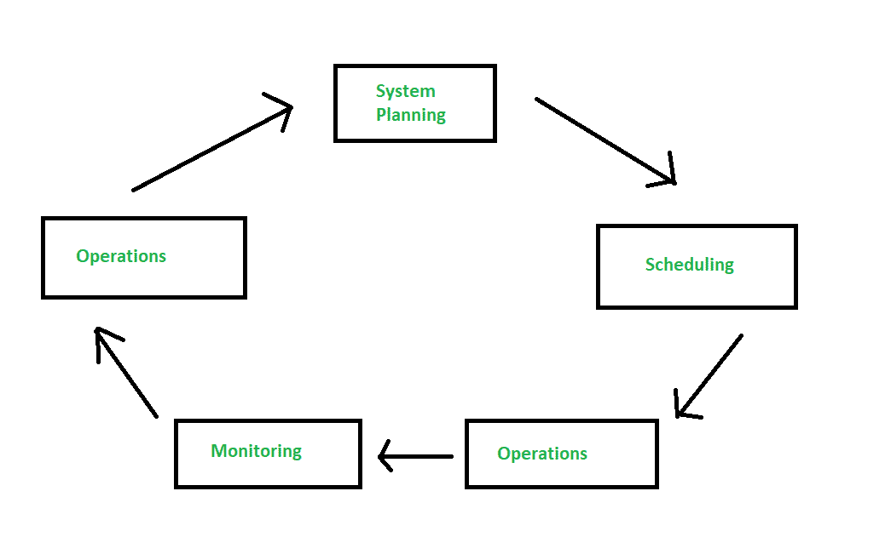
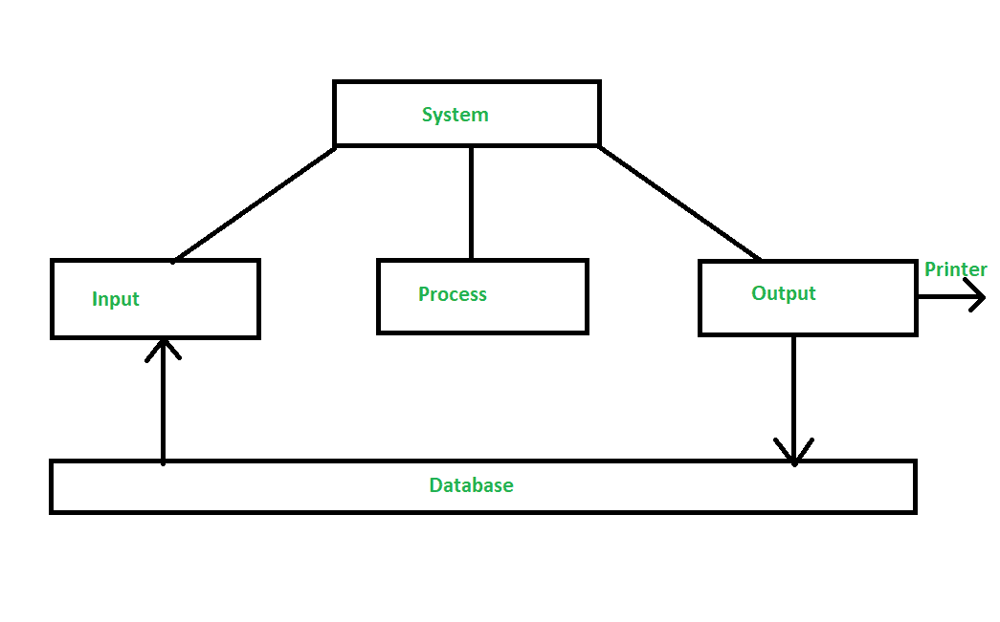

# MIS 和 DPS 的区别

> 原文:[https://www . geesforgeks . org/miss 和 dps 之间的区别/](https://www.geeksforgeeks.org/difference-between-mis-and-dps/)

**1。[管理信息系统(MIS)](https://www.geeksforgeeks.org/management-information-system-mis/) :**
MIS 是计算机相关技术对程序的应用。它为管理者提供有效决策的信息和支持，并提供日常运营的反馈。输出或报告通常是通过累积交易处理数据生成的。

它确保从有效来源收集适当的数据，进行处理并传递到需要的目的地。它通过查询系统、分析系统、建模系统来满足需求。

管理信息系统的主要特点是:

*   它支持数据处理功能。
*   它使用集成的数据库，支持多种功能领域。
*   它提供运营、战术和战略层面的组织。
*   它是灵活的
*   它能适应组织不断变化的需求，这是管理信息系统的一大优势。

**例如:**人力资源管理系统、销售和营销系统等。

**2。数据处理系统(DPS) :**
DPS 是计算机对数据的操作。它代表支持操作的例程处理的自动化。基本上，它将原始数据转换成组织中的人容易使用的可读格式。

[数据](https://www.geeksforgeeks.org/what-is-data/)处理功能是用于报告和分析业务活动的数据收集、处理、存储。它主要面向处理日常事务的事务数据。

数据处理有六个阶段:

*   数据收集
*   数据准备
*   数据输入
*   处理
*   数据输出
*   数据存储

**例如:**在库存控制软件程序中输入销售数字。

**MIS 和 DPS 的区别:**

| 管理信息系统 | 数据表示系统(Data Processing Station) |
| --- | --- |
| 它使用集成的数据库。 | 它不使用集成数据库。 |
| 它为管理层提供了更大的灵活性。 | 它没有提供这样的灵活性。 |
| 它整合了功能区之间的信息流。 | 它倾向于支持单一的功能区域。 |
| 它关注各级管理层的信息需求。 | 它侧重于部门级支持。 |
| 输出是图形的形式。 | 输出是表格的形式。 |
| 模型很简单。 | 有时，模型变得复杂。 |
| 侧重于操作功能。 | 它侧重于将数据转换成另一种形式或语言。 |

