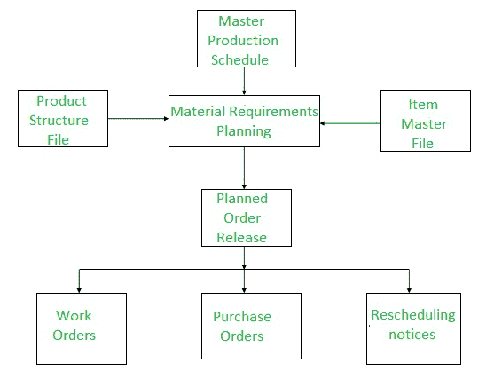
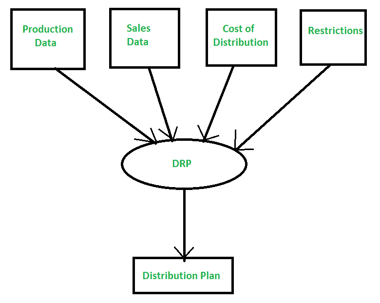

# MRP 和 DRP 的区别

> 原文:[https://www . geesforgeks . org/MRP 和-drp 之间的差异/](https://www.geeksforgeeks.org/difference-between-mrp-and-drp/)

**1。[物料需求计划(MRP)](https://www.geeksforgeeks.org/evolution-of-erp-system/) :**
发展于 20 世纪 70 年代，管理任何组织所需的原材料，即公司所需的材料存储在数据库中。此外，它还说明了任何材料的短缺。物料需求计划是工业生产计划和调度中广泛使用的方法。这是一种嵌入在许多商业软件应用程序中的方法。

物料需求计划的功能是提供物料可用性，即用于按时生产需求数量。这一过程涉及对库存和需求的监控，从而自动创建采购或生产的采购建议。物料需求计划的主要目标是确定需要哪些物料、需要多少数量以及何时需要。它是要素材料库存，强调实物资产。

**2。配送需求计划(DRP) :**
是**物料需求计划(MRP)的延伸。**这是一个通过确定货物的数量和地点来提高交货效率的过程。

公司利用它来确保在适当的时间和地点获得适当数量的材料。它采用分时段的计划，以确保最终产品的及时生产。DRP 的关键要素是:需求、当前库存水平、目标安全库存、数量和补货提前期。

**MRP 和 DRP 的区别:**

| 物资需求计划(material requirements planning) | 分销资源计划(distribution resource planning) |
| --- | --- |
| 代表物料需求计划。 | 代表分销需求计划。 |
| 它在公司的控制之下。 | 它不在公司的控制之下。 |
| 它控制库存，直到制造完成。 | 它在制造完成后控制制造。 |
| 它由生产计划指导。 | 它以客户需求为导向。 |
| 它在依赖需求的情况下运行。 | 它在独立需求的情况下运行。 |
| 它协调物料的调度和整合。 | 它协调出口和供应源之间的需求。 |

