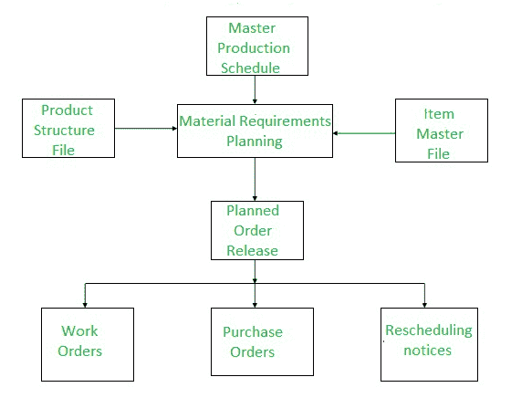
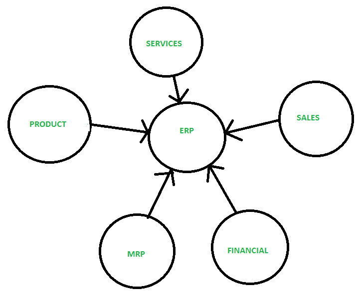

# MRP 和 ERP 的区别

> 原文:[https://www . geesforgeks . org/MRP 和 erp 的区别/](https://www.geeksforgeeks.org/difference-between-mrp-and-erp/)

**1。物料需求计划(MRP) :**
发展于 20 世纪 70 年代，管理任何组织所需的原材料，即公司所需的材料存储在数据库中。此外，它讲述了任何材料的短缺。物料需求计划是工业生产计划和调度中广泛使用的方法。这是一种嵌入在许多商业软件应用程序中的方法。

物料需求计划的功能是提供物料可用性，即用于按时生产需求数量。这一过程涉及对库存和需求的监控，从而自动创建采购或生产的采购建议。物料需求计划的主要目标是确定需要哪些物料、需要多少数量以及何时需要。它是要素材料库存，强调实物资产。

**2。[企业资源计划(ERP)](https://www.geeksforgeeks.org/evolution-of-erp-system/) :**
企业资源计划是国内和全球运营的基础系统，支持其日常运营中的大部分或全部功能领域。是商业软件中比较常见的类别之一，尤其是对于大型企业。

它是一种业务策略和一组特定于行业领域的应用程序，通过启用和优化企业和企业间的协作运营和财务流程，构建客户和股东社区价值网络系统。企业资源规划的核心是通过数据管理集中信息和工作流程的有效方式。因为 ERP 将您所有的工作流数据保存在一个地方。

它使用分析工具来比较不同的产品，从而进行进一步的开发。基本上，这是向无形资产的转移。

**MRP 与 ERP 的区别:**

| 物资需求计划(material requirements planning) | 企业资源计划（Enterprise Resource Planning） |
| --- | --- |
| 代表物料需求计划。 | 代表企业资源规划。 |
| 发展于 20 世纪 70 年代。 | 发展于 90 年代。 |
| MRP 更多的是一个单独的软件。 | 整合了企业资源规划。 |
| 它可以与其他软件结合，但这是一个比企业资源规划更困难的过程。 | 它可以轻松连接到其他软件系统和模块。 |
| 物料需求计划系统是制造操作的专属。 | 企业资源规划是许多行业的标准，由许多部门处理。 |
| 用户有限。 | 庞大的用户群体，因为 ERP 在各种工作中都有它的范围。 |
| 它不太贵。 | 它很贵。 |

