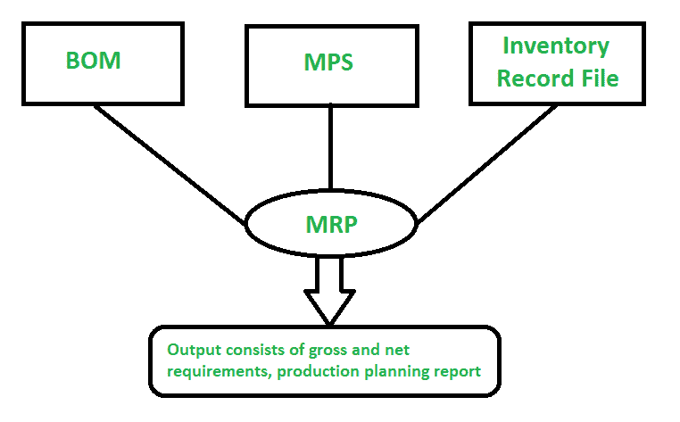
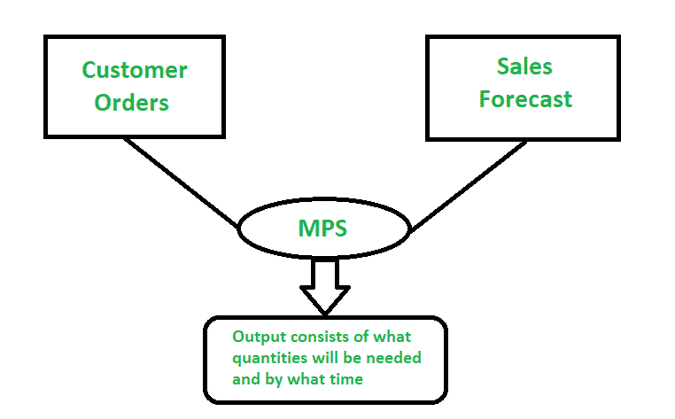

# MRP 和 MPS 的区别

> 原文:[https://www . geesforgeks . org/MRP 和-mps 之间的差异/](https://www.geeksforgeeks.org/difference-between-mrp-and-mps/)

**主生产计划(MPS)****物料需求计划(MRP)** 是制造计划系统和库存计划系统的组成部分。这是两个独立的软件系统，提供了简化制造过程的方法。需求是任何库存计划系统的关键驱动因素，因此让我们先了解这个需求，然后我们将了解主生产计划和物料需求计划的区别和用途。

**需求:**
需求驱动任何库存计划和制造系统。
有两种需求，即

*   **独立需求项目:**
    项目是指直接客户的需求，是指需求直接来自客户，此类项目也称为顶层项目。这些物品通常有物料清单(BOM)并出售。
*   **从属需求项目:**
    需要生产的项目，此类项目也称为下级项目。生产所需的原材料和子组件属于相关需求项目。这些项目是物料清单。

**1。物料需求计划(MRP) :**
物料需求计划关于具有**相关需求**的物料。需要生产的物料的物料需求计划。它计划我们有什么材料，我们需要多少，我们期望购买和消费多少。

下图**说明物料需求计划的工作:**

材料资源计划

**2。主生产计划(MPS) :**
主生产计划计划具有**独立需求**的物料。MPS 根据客户的直接需求/销售订单和预测计划物料。在生产要素的过程中，会考虑库存成本、生产成本、产能、工作时间、库存水平、可用存储等。主生产计划不是每天运行，而是根据订单和预测期每周运行。

下图**说明主生产计划的工作:**

主生产计划

**我们举一个例子，将了解每个的使用场景:**
MPS 和 MRP 分别运行只是为了满足变更请求。让我们举一个例子，钢笔是主生产计划项目，不同的零件/组件，如帽子，桶，笔芯等是物料需求计划项目。物料需求计划运行更频繁，以获得生产和维护生产计划所需的行动信息。MPS 不是每天运行，而是以一周或更长时间为基础运行，并通过制造新更改的产品来处理更改请求。

**MRP 和 MPS 的区别:**

| 没有。 | 物资需求计划(material requirements planning) | 主生产计划 |
| 01. | 物料需求计划是指制造计划系统和库存计划系统中的物料需求计划。 | 主生产计划是指制造计划系统和库存计划系统中的主生产计划。 |
| 02. | 它计划具有相关需求的物料。 | 它计划有独立需求的项目。 |
| 03. | 需求随着产品的生产而传递。 | 需求直接来自客户或预测或服务订单。 |
| 04. | 它每天运行以收集关于所需材料的想法并据此进行计划。 | 它基于销售订单/服务订单和该期间的预测每周运行一次。 |
| 05. | 物料需求计划是对关键产品的计划。 | 主生产计划是对任何一种物料的计划。 |
| 06. | 它在 MPS 之后运行。 | 它在 MRP 之前运行。 |
| 07. | 物料需求计划用于多级计划。 | 主生产计划用于单层计划。 |
| 08. | 物料需求计划项目的例子:盖子、桶、弹簧和再装。 | MPS 项目的例子是钢笔。 |

