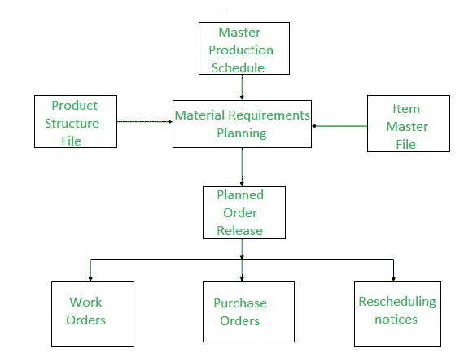
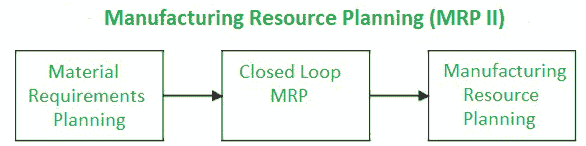

# MRP 和 MRP II 的区别

> 原文:[https://www . geesforgeks . org/MRP-和-mrp-ii 的区别/](https://www.geeksforgeeks.org/difference-between-mrp-and-mrp-ii/)

先决条件–[企业资源规划系统的演进](https://www.geeksforgeeks.org/evolution-of-erp-system/)

**1。物料需求计划(MRP) :**
发展于 20 世纪 70 年代，管理任何组织所需的原材料，即公司所需的物料存储在数据库中。此外，它还说明了任何材料的短缺。物料需求计划是工业生产计划和调度中广泛使用的方法。

物料需求计划的功能是提供物料可用性，即用于按时生产需求数量。这一过程涉及对库存和需求的监控，从而自动创建采购或生产的采购建议。物料需求计划的主要目标是确定需要哪些物料、需要多少数量以及何时需要。它是要素材料库存，强调实物资产。

**2。制造资源计划(MRP II) :**
制造资源计划发展于 20 世纪 80 年代，是管理整个制造公司的闭环 MRP 的扩展。该系统提供了对所有职能部门都有用的信息，并鼓励跨职能部门的互动。在这种情况下，属于制造单元的任务是自动化的或相互关联的，因此最终的生产应该增加。

它通过提供和订购承诺能力来支持销售和营销。这是一个基础广泛的资源协调系统，在规划过程中涉及公司的其他领域，如营销、财务和人力资源。

**MRP 和 MRP II 的区别:**

| 物资需求计划(material requirements planning) | MRP 二号 |
| --- | --- |
| 代表物料需求计划。 | 代表制造资源计划。 |
| 发展于 20 世纪 70 年代。 | 发展于 80 年代。 |
| 工业生产计划和调度中广泛使用的方法。 | 提供对所有职能部门都有用的信息，并鼓励跨职能部门的互动。 |
| 旨在发布和管理生产订单和采购申请。 | 旨在控制相关物流和生产能力，同时考虑这些物流和所需能力之间的关系。 |
| 物料需求计划仅仅是为了确保在特定的体积内制造特定零件的材料。 | 它负责工作的所有其他方面，包括订购、跟踪库存和确保产能。 |
| 它需要所有的投入，以确保您在任何给定的时间都有适量的材料/劳动力/机器来满足市场或您公司的生产目标。 | MRP II 使用来自会计记录和销售的额外数据来进一步分析和预测制造需求。 |

