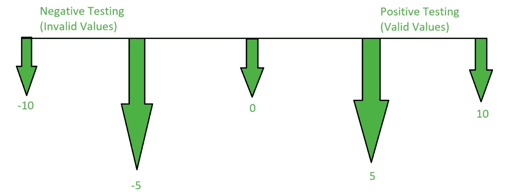

# 阳性检测和阴性检测的区别

> 原文:[https://www . geesforgeks . org/阳性检测和阴性检测的区别/](https://www.geeksforgeeks.org/difference-between-positive-testing-and-negative-testing/)

**阳性测试:**
阳性测试是一种软件测试，通过假设一切都如预期的那样来执行。它是在假设只有有效和相关的事情才会发生的情况下执行的。数据集和所有其他功能将如预期的那样。

**阴性测试:**
阴性测试是一种软件测试，用于检查系统是否存在意外情况。负测试在高性能软件开发中起着非常重要的作用。它检查在这种意外情况下软件的行为。

**阳性检测和阴性检测的区别:**

| 阳性检测 | 阴性测试 |
| --- | --- |
| 仅在预期条件下执行。 | 它是针对意外情况执行的。 |
| 它没有涵盖所有可能的情况。 | 它涵盖了所有可能的情况。 |
| 这不能保证产品质量好。 | 它保证了产品的质量。 |
| 与阴性测试相比，它不太重要。 | 这比阳性检测更重要。 |
| 它可以由知识较少的人来完成。 | 只能由专业人员来执行。 |
| 它需要更少的时间。 | 需要更多的时间。 |
| 它在每个应用程序上执行。 | 它在可能出现意外情况的地方执行。 |
| 它确保软件正常。 | 它确保 100%无缺陷的软件。 |