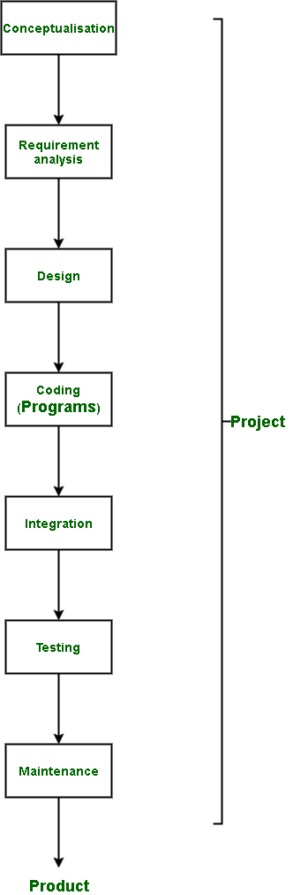

# 程序、项目和产品的区别

> 原文:[https://www . geesforgeks . org/程序-项目-产品的区别/](https://www.geeksforgeeks.org/difference-between-program-project-and-product/)

**1。程序:**
当今世界上一个计算机系统有多种用途。其中一个用途是在编写程序时观察到的。程序是给计算机执行特定任务的指令。它是与计算机系统通信的媒介。

**2。项目:**
项目是一项创新性的努力，旨在创造一个尚未制作的软件。项目由软件团队根据企业的要求承担。它必须经过七个阶段才能完成。[阶段](https://www.geeksforgeeks.org/software-development-life-cycle-sdlc/)涉及设计、测试、编码、维护等。

**3。产品:**
软件项目经历了需求分析、设计、编码、测试、集成和维护阶段。所有阶段完成后，产品就形成了。这是一个为解决一个独特问题而制作的软件。为了销售，产品大量生产。

**项目、项目、产品差异:**

| 没有。 | 程序 | 项目 | 产品 |
| --- | --- | --- | --- |
| 1. | 它包含执行特定任务的说明。 | 它在软件开发生命周期中执行，以创建独特的软件。 | 它是一个项目的成果。 |
| 2. | 它不需要关注效率和成本。 | 由于预算限制，它注重成本和质量。 | 它关注的是效率和成本，因为这影响到它的盈利能力。 |
| 3. | 它永久存在于辅助存储设备上。(除非销毁或删除) | 在所有阶段都导致产品之后，它就不存在了。(这是项目完成的时候，现在称为产品。) | 除非卸载或删除，否则它可以存在。 |
| 4. | 它可以在长达 3 个月的时间内完成，直接取决于规模和复杂性。 | 它可能需要长达 3 年的时间才能完成。这是由于它经历的不同阶段和维护。 | 只要产品有利可图，并且提供产品的企业对其感兴趣，它就会持续生产。 |
| 5. | 项目经理处理项目。 | 项目经理处理项目。 | 产品经理对产品负责。 |
| 6. | 它有存储程序的内存需求。 | 它有记忆、时间以及人力资源要求。 | 它有人力、技术和时间要求。 |
| 7. | 程序的主要焦点是结果输出。 | 这个项目的主要焦点是开发一种新的软件，这种软件还没有制造出来。 | 产品的主要焦点是其盈利能力和用户满意度。 |
| 8. | 该计划不需要指南。 | 指导方针对于项目开发是必要的，因为它涉及到在不同团队中工作的许多人。 | 需要严格的指导方针来完成和制造产品。 |

