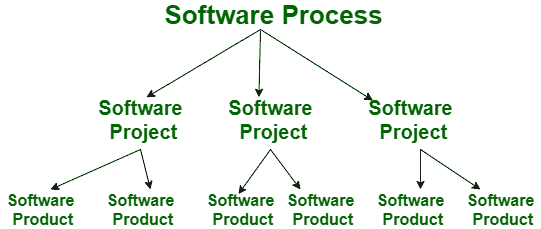
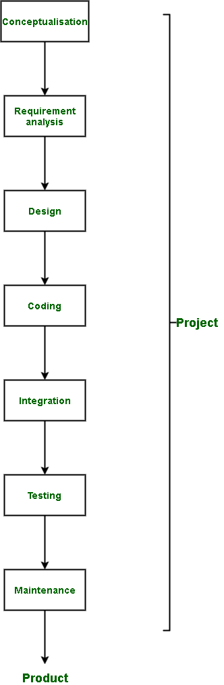

# 项目与产品的区别

> 原文:[https://www . geesforgeks . org/项目与产品的区别/](https://www.geeksforgeeks.org/difference-between-project-and-product/)

**1。项目:**
也称为软件项目，包括在产品实际上市之前制作产品的步骤。该项目可以由少至一人、多至多人(超过 100 人)参与的人来处理。这些通常由企业分配，并承担形成尚未制造的新产品。

**2。产品:**
对产品的研究是软件工程的一部分。该软件是由开发人员根据客户的要求构建的。客户对开发过程满意后，通过制造软件来启动软件。这可以是一个解决问题的软件或基于计算机的系统。这是一个项目的结果。软件项目完成后，在市场上可以使用后，就被称为产品。

项目完成后，产品就出现了。

**项目与产品差异:**

| 没有 | 项目 | 产品 |
| --- | --- | --- |
| 1. | 它包括在软件真正上市之前制作软件的步骤。 | 它是为用户制造的项目。 |
| 2. | 一个项目的主要目标是形成一个尚未制造的新产品。 | 产品的主要目标是成功完成工作(解决特定问题)。 | 3. | 项目正在进行，以形成一个新的软件。 | 产品是项目的最终产品。 |
| 4. | 它侧重于提高正在构建的软件的性能。 | 一个产品关注的是最终的结果和解决给定问题的效率。 |
| 5. | 一个项目只做一次就能得到一个新软件。 | 一个产品可以一次又一次地制造出来，目的是在用户之间分配。 |
| 6. | 这里的风险更大，因为这是第一次制作软件。 | 这相对来说风险较小，因为软件已经被制造和测试过了。在大多数情况下，唯一的风险是磨损。 |
| 7. | 它由项目经理处理。 | 它由产品经理处理。 |
| 8. | 它存在于软件制作之前。 | 它存在于软件开发阶段完成之后。 |
| 9. | 由于企业为项目设定了固定预算，因此存在一些成本障碍。 | 它没有成本障碍，因为只有当分销企业盈利时，它才会继续发展。 |

