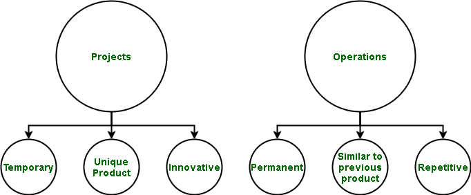

# 项目和运营的区别

> 原文:[https://www . geesforgeks . org/项目与运营的区别/](https://www.geeksforgeeks.org/difference-between-projects-and-operations/)

项目和运营都是产品生命周期的一部分。

**1。项目:**
任何软件都是分阶段开发的。这些被称为软件开发生命周期阶段。它们从需求收集开始，包括设计、编程(编码)、集成、测试和维护。所有这些在特定时间范围内进行的产品创建过程统称为项目。项目是一种临时性的努力，是为了生产一种独特的产品。

**2。运营:**
产品生产出来后，就被推向市场。使用先前使用的相同技术一次又一次地创造产品的过程，目的是分配给用户和(在大多数情况下是盈利)是运营的一部分。操作是在产品生产出相同的结果或重复的服务后进行的活动的持续执行。生产、制造和会计都是运营的例子。

**项目与运营的区别:**

| 南号码 | 种类 | 项目 | 操作 |
| --- | --- | --- | --- |
| 1. | 定义 | 项目是一种临时性的努力，是为了生产一种独特的产品。 | 操作是在产品生产出相同的结果或重复的服务后进行的活动的持续执行。 |
| 2. | 持续时间 | 它是暂时的，因为它在产品制造后不存在。这是因为产品制造前的阶段包括一个项目。 | 它是永久的，因为它只存在于产品制造之后，并且可以永远持续下去。同样的产品，只要有需求，或者只要产生利润，就制造出来。 |
| 3. | 预算 | 预算是为项目定义的。希望生产产品的股东和管理层会为产品制定预算。 | 预算不是为运营定义的，因为需要赚取收入来维持运营。这是因为如果产品有很大的反响或足够的收入和利润，就可以制造更多这样的产品。 |
| 4. | 新奇 | 它是新的(新产品)。正在进行一个项目来创造一种新产品。 | 它没有什么新东西。这是因为它只是制造更多数量的产品以便在用户之间分配的过程。 |
| 5. | 产品 | 创造独特的产品。这个项目是为了创造一种独特的产品。 | 生产相同的产品来保持系统运行。更多的现有产品是为最终用户制造的。 |
| 6. | 风险 | 这是第一次，风险更大。有失败的风险，因为特定的东西从来没有被制造过。 | 它的风险更小，因为这种产品以前已经生产过，它只是大量生产的过程。 |
| 7. | 焦点 | 绩效是项目的主要关注点。该项目必须具有最佳性能，并满足客户指定的要求。 | 效率是首要关注点。整个操作必须以有效的方式进行，以减少制造时间和优化流程，从而获得更好的收入。 |
| 8. | 管理类型 | 项目管理被称为项目管理 | 运营管理被称为业务流程管理。 |
| 9. | 承诺的理由 | 可以根据机会或业务需求、社会需求、技术提升、客户私人需求、市场需求、法律要求等进行。 | 这样做是为了经营业务和维持系统。 | 10. | 基础 | 项目是基于实现需求规格说明阶段指定的目标。 | 运营基于衡量整个产品的标准。 | 11. | 组织 | 处理项目的组织称为项目化组织。 | 处理运营的组织称为职能组织。 | 12. | 存在 | 项目存在于产品制造之前。这是因为一旦项目完成并上市，
就称为产品。 | 操作只存在于产品制造之后。之所以如此，是因为只有制造出一个产品，才能开发出更多这样的产品。 | 13. | 自然 | 它具有创新性。这个项目是为开发新产品而进行的。 | 它本质上是重复的。制造产品的过程再一次被重复用于其他几个产品的制造。 |

