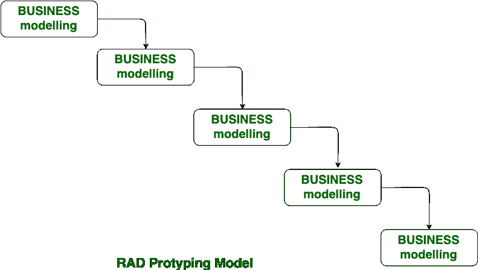

# RAD 模型和瀑布模型的区别

> 原文:[https://www . geesforgeks . org/rad-model 和瀑布-model 的区别/](https://www.geeksforgeeks.org/difference-between-rad-model-and-waterfall-model/)

**[瀑布模型](https://www.geeksforgeeks.org/software-engineering-classical-waterfall-model/) :**
瀑布模型又称古典或传统模型。有时它被称为线性顺序生命周期模型，因为该模型中涉及的所有阶段都以线性方式逐个完成。在这个模型中，我们在完成所有编码阶段后得到软件。这种模式基本上用于小型项目。瀑布模型中只有一个循环。

**[RAD 模型](https://www.geeksforgeeks.org/software-engineering-rapid-application-development-model-rad/) :**
RAD 模型代表快速应用开发，是[增量模型](https://www.geeksforgeeks.org/software-engineering-incremental-process-model/)的类型。它不能处理大型项目，但它可以处理小型项目以及中型项目。在 RAD 模型中，任何变化都可以在任何阶段进行，但是在瀑布模型中，这是不可能发生的。

**RAD 模型与瀑布模型的区别:**

| S.No | 瀑布模型 | RAD 模型 |
| 1. | 瀑布模型被称为经典/传统模型。 | 代表快速应用开发。 |
| 2. | 瀑布模型存在较高的金额风险。 | RAD 模型中存在低金额风险。 |
| 3. | 在瀑布模型中，需要大的团队规模。 | 在 RAD 模型中，需要小团队规模。 |
| 4. | 瀑布模型无法处理大型项目。 | RAD 模型也不能处理大型项目，但通常在大型和小型项目之间是首选的。 |
| 5. | 瀑布模型中的任何更改只能在开始时进行。 | RAD 模型可以随时进行任何更改。 |
| 6. | 瀑布模型的产品在所有阶段完成后交付。 | RAD 型号的产品尽快交付。 |
| 7. | 瀑布模型运行软件等待时间长。 | 在 RAD 模式下运行软件的等待时间更少，因为它的第一个版本会尽快发布。 |
| 8. | 瀑布模型与客户需求的变化不兼容。 | RAD 模型可以随着客户需求的变化而变化。 |