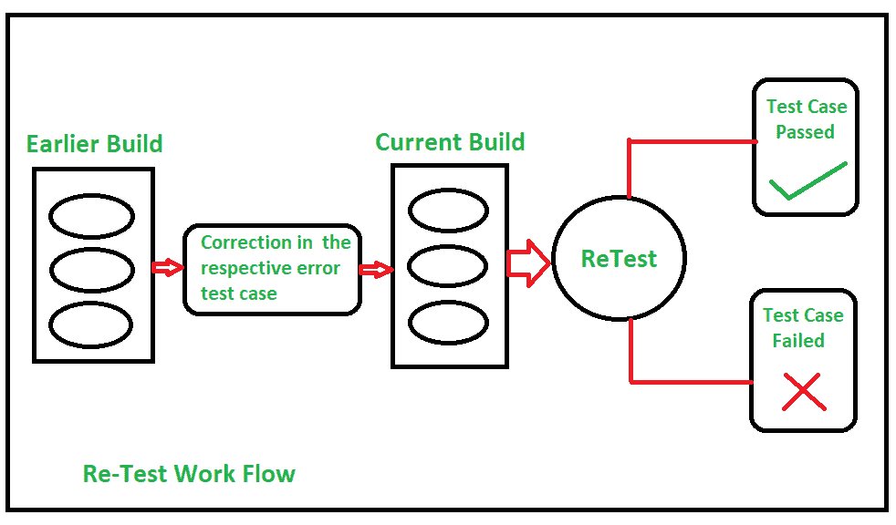
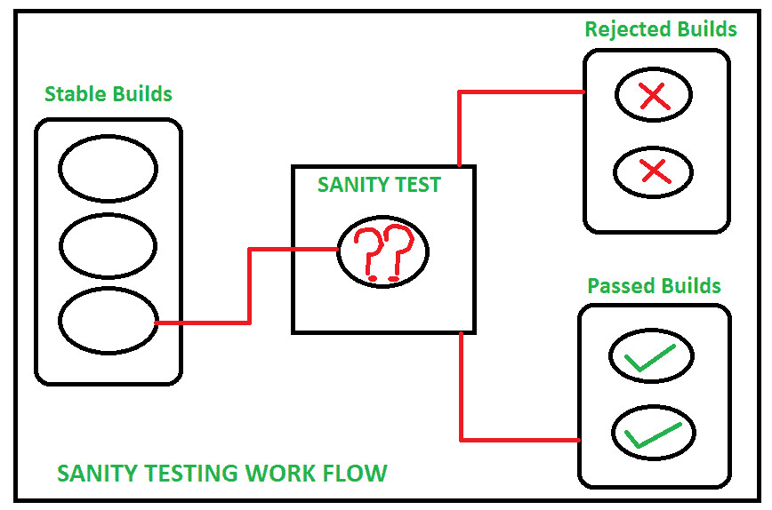

# 重新测试和健全性测试的区别

> 原文:[https://www . geesforgeks . org/重新测试和健全性测试的区别/](https://www.geeksforgeeks.org/difference-between-re-testing-and-sanity-testing/)

先决条件–[软件测试](https://www.geeksforgeeks.org/software-testing-basics/)

**1。重新测试:**
在软件测试中，重新测试是指对一个模块再次进行测试，以确保 bug 得到修复。这意味着它确认在最终执行中失败的测试用例在错误/缺陷被修复后通过。

重新测试的过程如下–

*   首先，在应用程序的任何模块中检测到错误。
*   然后由开发者对其进行校正/修改。
*   开发人员再次解决并测试问题后，称为重新测试。

**2。[健全性测试](https://www.geeksforgeeks.org/sanity-testing-software-testing/) :**
在软件测试中，健全性测试是指在接收到软件构建后执行的测试，对代码或功能进行微小的更改，以确定错误/错误已经得到修复，并且不会由于这些更改而引入进一步的问题。

健全性测试的过程如下–

*   首先接收软件构建。
*   确定建议的功能在更改后大致按预期工作。
*   如果健全性测试失败，构建将被拒绝。
*   如果健全性测试通过，则通过进一步测试。

**重新测试和正常测试的区别:**

| 没有。 | 重新测试 | 健全性测试 |
| 1. | 执行重新测试是为了检查和确认在最终执行中失败的测试用例在那些错误/缺陷被解决后是通过的。 | 进行健全性测试是为了检查和确认在小的功能/错误修复或任何改变之后，这些功能正在完美地工作。 |
| 2. | 缺陷验证属于重新测试的一部分。 | 缺陷验证不属于完整性测试的一部分。 |
| 3. | 在健全性测试和[回归测试](https://www.geeksforgeeks.org/software-engineering-regression-testing/)开始之前进行重新测试。 | 在回归测试之前和[烟雾测试](https://www.geeksforgeeks.org/smoke-testing-software-testing/)之后进行健全性测试。 |
| 4. | 测试用例不能自动进行重新测试。 | 健全性测试通常是手工执行的。 |
| 5. | 可以用以前使用过的测试用例来执行重新测试。意味着测试用例可以被重用。 | 可以在没有具有领域知识的测试用例的情况下执行健全性测试。 |
| 6. | 重新测试的优先级高于健全性测试。 | 健全性测试的优先级低于健全性测试。 |
| 7. | 在测试开始之前，不能获得重新测试的测试用例。 | 健全性测试的测试用例可以从功能规范、手册和与纠正问题相关的缺陷报告中获得。 |

