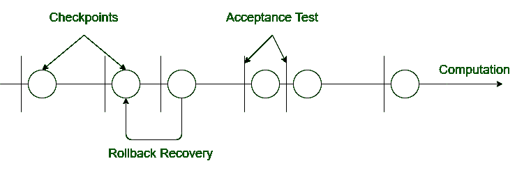

# 复苏模块与心肺复苏复苏的区别

> 原文:[https://www . geeksforgeeks . org/recovery-blocks-and-CPR-recovery/](https://www.geeksforgeeks.org/difference-between-recovery-blocks-and-cpr-recovery/)

先决条件–[容错技术](https://www.geeksforgeeks.org/fault-tolerance-techniques-in-computer-system/)
**1。恢复块:**
在恢复块技术中，不同的尝试块使用不同的算法。试块基本上是冗余组件。这里，冗余副本不会同时运行。每次试块的结果都通过验收测试进行测试。

**2。检查点和回滚恢复(CPR 恢复):**
检查点回滚恢复技术不同于软件容错的恢复块技术。每次用这种技术测试系统时，我们都会进行一些计算。当出现处理器故障或数据损坏时，这种技术非常有用。

**复苏模块和心肺复苏的区别:**

| 恢复块 | 心肺复苏术 |
| --- | --- |
| 不同的软件副本由不同的算法开发。 | 只开发软件的单一副本。 |
| 冗余副本一个接一个地运行。 | 这里没有多余的副本。 |
| 系统不会在每次计算后进行测试。 | 每次计算后都要对系统进行测试。 |
| 需要选择开关在不同的副本之间进行选择。 | 这里不需要任何选择开关。 |
| 它用于处理器发生故障的可能性较小的情况。 | 虽然它在处理器故障几率很高时很有用。 |
| 这种技术用于数据损坏可能性较小的地方。 | 而在数据损坏几率高的地方使用。 |
| 它用于更松弛的任务。 | 它用于正常松弛的任务。 |
| 它对于关键系统来说效率不高。 | 它对所有系统都是中等效率的。 |
| 仅当任务截止时间超过任务计算时间时使用。 | 这项技术不需要这样的条件。 |

