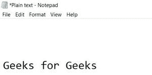

# 富文本和纯文本的区别

> 原文:[https://www . geesforgeks . org/富文本和纯文本的区别/](https://www.geeksforgeeks.org/difference-between-rich-text-and-plain-text/)

**什么是文字**。:-单词或字母的集合称为文本。

这是一个纯文本-极客为极客

这是一篇丰富的文字——**<u>极客</u>** ***为*** <u>极客</u>

从以上两种类型的文本中可以清楚地看出，我们现在要处理的是让我们一个一个地详细了解它们以及它们之间的区别。

**1。纯文本:**
纯文本是没有附加或嵌入样式的文本。它只是一个纯文本，即简单文本。它是由美国硬件设计师在 60 年代和 70 年代创造的。带有纯文本的文件用。txt 或。TXT 扩展名。

**纯文本的优势–**

*   如果你用纯文本写东西，那么无论何时你在任何机器上打开这个文件，最终的结果都是一样的，那就是它会像在每个系统上一样显示文本。与富文本不同，如果你格式化文本并添加样式，那么它可能会产生问题，如果最终用户没有合适的应用程序，那么它会扭曲其样式，结果会给用户留下不好的印象。
*   它快速灵活，因为它不使用样式和格式，所以它快速灵活。
*   与富文本格式相比，纯文本格式的文件大小较小。

**纯文本的缺点–**

*   在当今时代，几乎 90%的文字处理器使用富文本格式。
*   它看起来非常基本，即没有样式。
*   阅读纯文本有时会变得无聊。

**纯文本示例–**

*   [https://drive . Google . com/file/d/1 qxwmnvspmy 3 zxbtt 0 cmbzoelpjswotwz/view？USP =共享](https://drive.google.com/file/d/1qxWMnVSpMy3ZxbTT0cmBZoeLPjSWOTWz/view?usp=sharing)
*   如果你把文本粘贴到普通的文字处理器中，那么它看起来就像下面给出的图片，即没有样式和格式。

**2。富文本:**
富文本是带有附加或嵌入样式的文本，因此每当您复制富文本并粘贴到支持富文本的编辑器时，它将自动包括所有样式、格式、间距等。富文本格式是由微软在 80 年代创建的，他们在 2008 年停止了富文本的开发..富文本文件通常与。rtf 或。RTF 扩展。

如果您在记事本或编辑器中粘贴给定的富文本，只使用纯文本格式，那么它将看起来像上面的图像，因为纯文本编辑器将只包含没有样式和格式的文本。

**富文本的优势–**

*   几乎 90%的文字处理器支持富文本格式。
*   有趣的是，像下面给极客的绿色文本这样的文本，而不是简单的文本，因为它包括样式和格式，因此开发人员学习如何设置文本的样式和格式。
*   让最终用户与文本保持联系，而不会感到厌烦。

**富文本的缺点–**

*   如果富文本文件是在不支持富文本的文字处理器中打开的，那么用户看起来就不太好，因为格式可能不支持文字处理器。
*   与纯文本相比，文件大小较大，因为它包含样式和格式信息
*   添加样式和格式也有点复杂，因为与纯文本相比，它需要更多的时间

**富文本示例–**

*   [https://docs . Google . com/document/d/1 mofz 9 和 84 NX 56 mkkfwzaviutplggppx 0o/edit？USP =共享&oui = 100618716104625854&RTP = true&SD = true](https://docs.google.com/document/d/1mOFZ9Y84nx56mKKfwzaviUTplGGPxM0o/edit?usp=sharing&ouid=100618971610824625854&rtpof=true&sd=true)
*   如果您在支持富文本的编辑器中粘贴文本，那么它将包括所有样式，格式如下图所示

### 富文本和纯文本的区别:

<figure class="table">

| **S，No** | **纯文本** | **富文本** |
| **1。** | 没有格式的文本 | 带格式的文本 |
| **2。** | 风格缺失 | 样式嵌入其中。 |
| **3。** | 文件用保存。txt 或。TXT 扩展 | 文件用保存。rtf 扩展或任何支持富文本格式的扩展，如。docx |
| **4。** | 由美国硬件设计师在 60、70 年代创造 | 由微软在 2008 年创建，后来他们在 2008 年停止了开发 |
| **5。** | 它是记事本、命令终端等的默认文本格式 | 它是微软 Word、谷歌 docx 等的默认文本格式 |
| **6。** | 用于电子邮件、密码学等。 | 用于 html 网页、微软文字等。 |
| **7。** | 例子——极客的极客。 | 例**极客**T2 为<u>极客</u> |
| **8。** | 不像在任何地方使用富文本格式那样频繁，因为它使格式化变得容易。 | 它被广泛使用，因为它使格式化变得容易。 |
| **9。** | 每当富文本在纯文本编辑器中粘贴时，它只包括符号、空格和换行符。 | 每当富文本粘贴到富文本编辑器中时，它就包括所有格式和样式。 |
| **10。** | 每当纯文本被粘贴到富文本编辑器中时，它就会被原样粘贴。 | 无论何时在纯文本编辑器中粘贴纯文本，都将按原样粘贴。 |
| **11 时。** | 文件大小(如果与富文本文件相比较小) | 文件大小(如果与纯文本文件相比较大) |
| **12 时。** | 兼容所有文字处理器 | 仅兼容支持富文本格式的文字处理器。 |

</figure>

**结论-:**

这完全取决于用户想要使用哪种类型的文本，比如如果他/她在 docx 和 notepad++上工作得更多，那么他们应该更喜欢使用富文本。反之亦然。