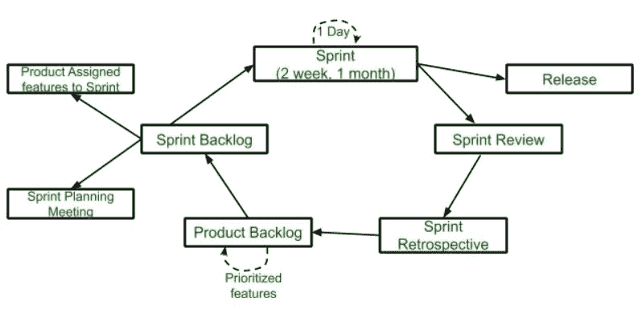
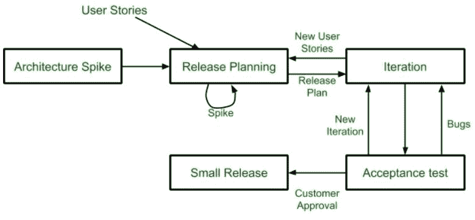

# 【Scrum 和 XP 的区别

> 原文:[https://www . geeksforgeeks . org/scrum 和-xp 之间的区别/](https://www.geeksforgeeks.org/difference-between-scrum-and-xp/)

敏捷框架主要有两种模式，即:Scrum 和极限编程。

**Scrum 框架:**
Scrum 是敏捷框架的类型。这是一个框架，在这个框架内，人们可以解决复杂的适应性问题，同时交付产品的生产力和创造力达到最高可能的价值。Scrum 使用迭代过程。

Scrum 的生命周期:

**极限编程(XP):**
极限编程是敏捷框架最重要的模型之一。这种模式强调团队合作和客户满意度。极限编程的五个基本组成部分是:

1.  沟通
2.  简单
3.  反馈
4.  尊重
5.  勇气

极限编程的生命周期:

| 混乱 | 极限编程 |
| --- | --- |
| 在 Scrum 框架中，团队在称为 Sprint 的迭代
中工作，该迭代长达 1-2 个月。 | 极限编程(XP)中，团队合作只需 1-2 周。 |
| Scrum 模型不允许改变他们的时间表或指导方针。 | 极限编程允许改变设定的时间线 |
| Scrum 强调自组织。 | 极限编程强调强大的工程实践 |
| 在 Scrum 框架中，团队决定了产品开发的顺序。 | 在极限编程中，团队必须遵循严格的优先级顺序或预先确定的优先级顺序。 |
| Scrum 框架没有完全描述。如果你想采用它，那么你需要用你自己的框架方法来填充框架，比如 XP、DSDM 或者看板。 | 极限编程(XP)可以直接应用于一个团队。极限编程也因其**随时可用的**特性而闻名。 |

