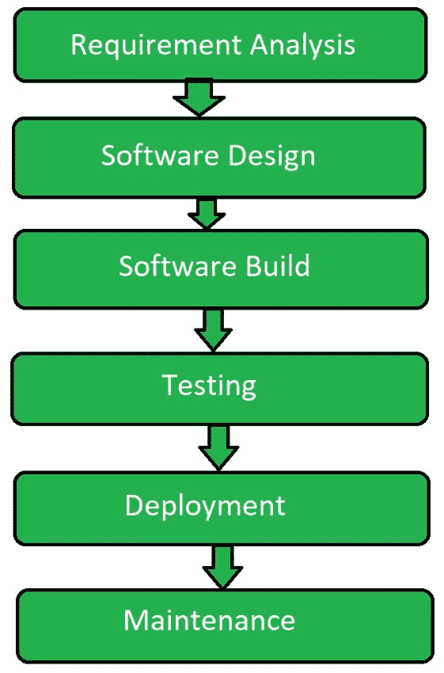
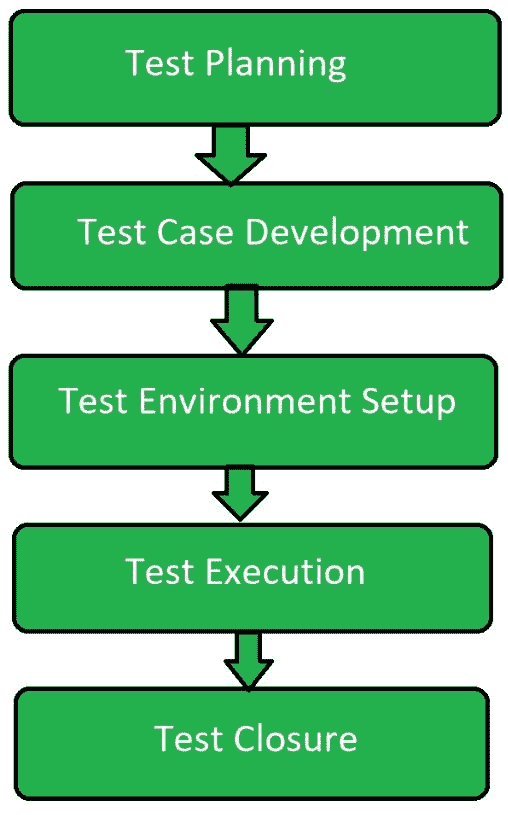

# 【SDLC 和 STLC 的区别

> 原文:[https://www . geesforgeks . org/difference-SDLC-and-stlc/](https://www.geeksforgeeks.org/difference-between-sdlc-and-stlc/)

[软件开发生命周期(SDLC)](https://practice.geeksforgeeks.org/problems/software-development-life-cycle) 是软件开发过程中执行的一系列不同活动。

[软件测试生命周期(STLC)](https://www.geeksforgeeks.org/software-testing-life-cycle-stlc/) 是在软件测试过程中执行的一系列不同的活动。

【SDLC 和 STLC 的区别:

| SDLC | stcc！stcc |
| --- | --- |
| SDLC 主要与软件开发相关。 | STLC 主要与软件测试相关。 |
| 除了开发，还包括其他阶段，如测试。 | 它只专注于测试软件。 |
| SDLC 总共包括六个阶段或步骤。 | STLC 只涉及五个阶段或步骤。 |
| 在 SDLC 中，整个过程需要更多数量的成员(开发人员)。 | 在 STLC 中，需要的成员(测试人员)数量较少。 |
| 在软件开发生命周期中，开发团队制定计划和设计。 | 在 STLC 中，测试团队制定计划和设计。 |
| SDLC 的目标是完成软件的成功开发。 | STLC 的目标是完成软件的成功测试。 |
| 它有助于开发高质量的软件。 | 它有助于消除软件缺陷。 |
| SDLC 阶段在 STLC 阶段之前完成。 | STLC 阶段在 SDLC 阶段之后执行。 |

