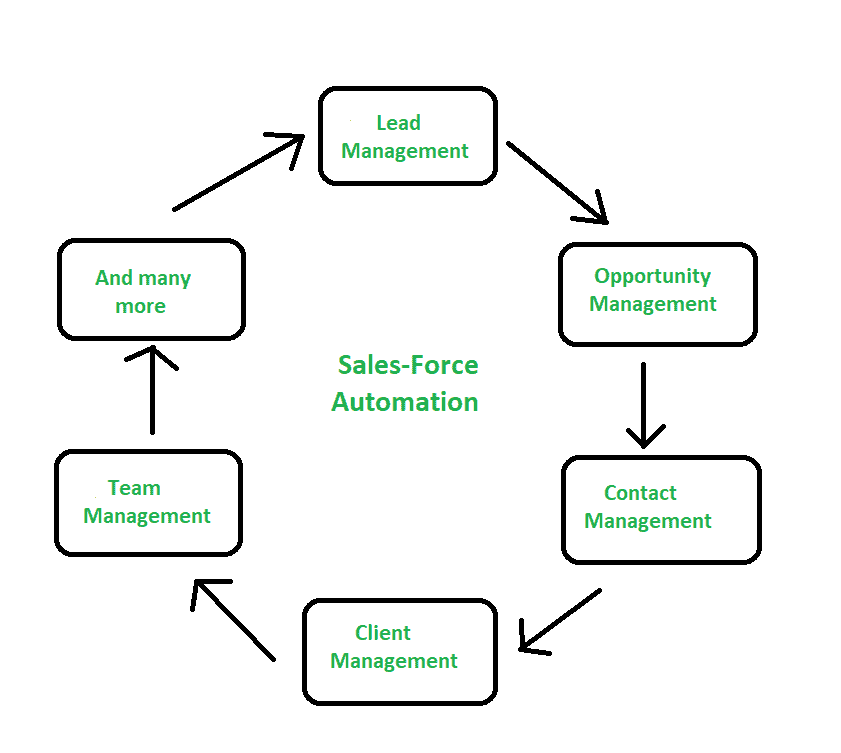
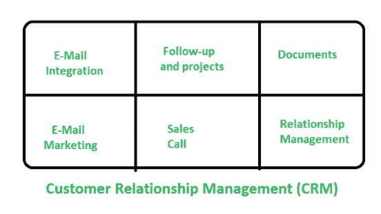

# SFA 和 CRM 的区别

> 原文:[https://www . geeksforgeeks . org/SFA 和-crm 的区别/](https://www.geeksforgeeks.org/difference-between-sfa-and-crm/)

**1。销售人员自动化(SFA) :**
销售人员自动化技术有助于跟踪销售人员的绩效，因为他们在推动销售和潜在客户的联系信息方面发挥着重要作用，因此会影响业务收入。这就是 SFA 产生的原因——客户需求如何变化，何时变化，什么是需求，以及这些因素如何影响业务。

它是一个信息技术工具，通过协调内部流程和后端数据库系统，将技术和信息集成在一起，以自动化销售人员和销售经理的销售任务。

**2。[客户关系管理(CRM)](https://www.geeksforgeeks.org/customer-relationship-management-crm/) :**
客户关系管理(CRM)就是找客户。一路上收集他们的信息，并利用这些信息来增强他们的经验和培养长期关系。基本上，这是一个建立和维护与客户关系的过程。

客户关系管理涉及电子邮件营销和集成、文档、销售电话、关系管理等。

**SFA 与 CRM 的区别:**

| 苏格兰足球协会 | 客户关系管理 |
| --- | --- |
| 它侧重于机会管理。 | 它侧重于工作管理。 |
| 活动列表可以在帐户中找到。 | 可以用不同的视角来查看和过滤活动。 |
| 它为每个销售团队成员提供了可操作的目标和指标。 | 客户概况，包括购买历史、行为数据等。 |
| 它记录电话和领导一般活动。 | 它跟踪与客户的沟通。 |
| 它存储联系信息。 | 它存储账户数据和电子商务通信。 |
| 它安排和跟踪约会。 | 它跟踪对销售和营销的反应。 |
| 它管理管道内衬、机会和工作流程。 | 它监控服务和支持交互。 |

