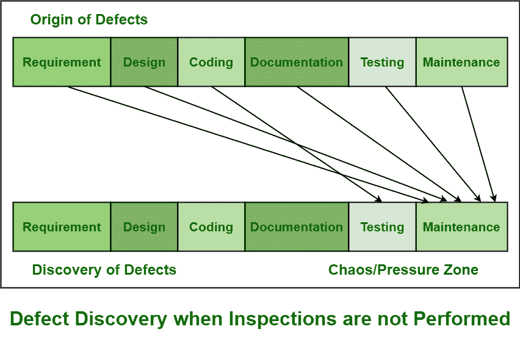
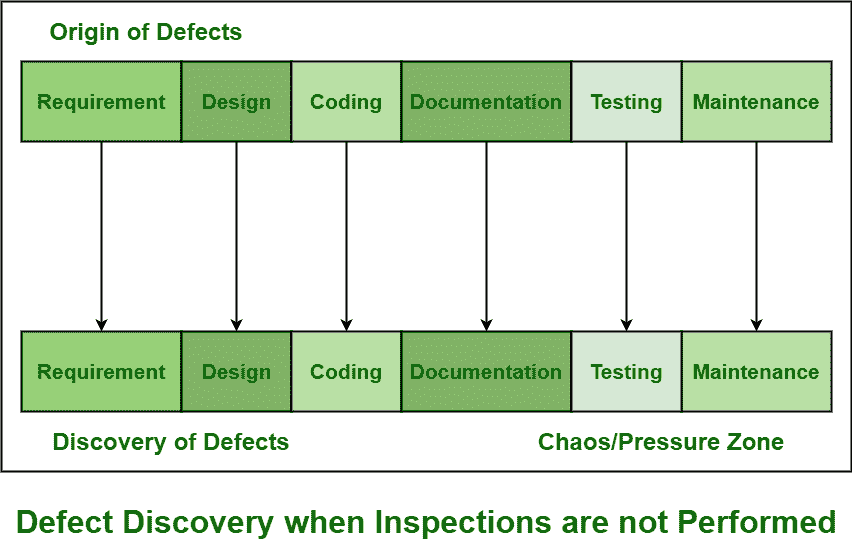

# 软件检查和软件测试的区别

> 原文:[https://www . geesforgeks . org/软件检查和软件测试的区别/](https://www.geeksforgeeks.org/difference-between-software-inspection-and-software-testing/)

[软件检查](https://www.geeksforgeeks.org/how-software-inspection-improves-software-quality/)和[软件测试](https://www.geeksforgeeks.org/software-testing-basics/)是识别和发现软件产品中的缺陷和错误所需要的两种重要的技术或方法。这两种方法通常都可以识别可以被移除和修复的缺陷，从而提高软件产品的质量。但是检查要方便得多，并且覆盖更大范围的开发阶段。软件检查在软件质量保证中也起着非常重要的作用。

1.  **[Software Development Life Cycle (SDLC)](https://www.geeksforgeeks.org/software-development-life-cycle-sdlc/) without Inspection :**

    下图显示了未执行检查且未纳入 SDLC 时的缺陷来源和缺陷发现阶段。但是软件测试活动通常只识别和发现编码缺陷。软件测试没有发现其他缺陷。需求、设计、[文件](https://www.geeksforgeeks.org/different-documentation-manuals-in-software-engineering/)、维护和测试中存在的缺陷通常在维护阶段被发现和识别。因此，在交付时会产生混乱。由于这个混乱地带，软件质量也会受到很大的影响。修复或修复缺陷的成本也会增加。

    

2.  **带检测的软件开发生命周期(SDLC):**
    下图显示，软件检测不仅拯救了我们，也拯救了我们的产品免受各种问题的困扰。当检查被纳入和应用时，凝视缺陷在同一阶段被识别，然后缺陷在同一阶段结束时被进一步移除和修复。这将基本上把我们从混乱地带拯救出来，也将在很大程度上最小化解决缺陷的成本。

软件检查在识别各种类型的错误方面也起着非常有效和重要的作用，而不是软件测试。如下表所示:

| 错误类型 | 软件检查 | 软件测试 |
| --- | --- | --- |
| 模块级的接口缺陷 | 是 | 不 |
| 代码复杂性 | 是 | 不 |
| 附加功能 | 是 | 不 |
| 产品可用性缺陷 | 不 | 是 |
| 性能误差 | 是 | 是 |
| 糟糕的代码结构 | 是 | 不 |
| 缺失或错误的功能 | 是 | 是 |
| 边界测试中的缺陷 | 是 | 是 |

在此表的“错误类型”列中，显示了软件产品中可能存在的不同类型的错误。其他两栏，即检验和测试，仅显示检验、测试或两者将识别的错误类型。从上表中，我们可以说在确定错误和缺陷方面，软件检查比软件测试更有效和重要。