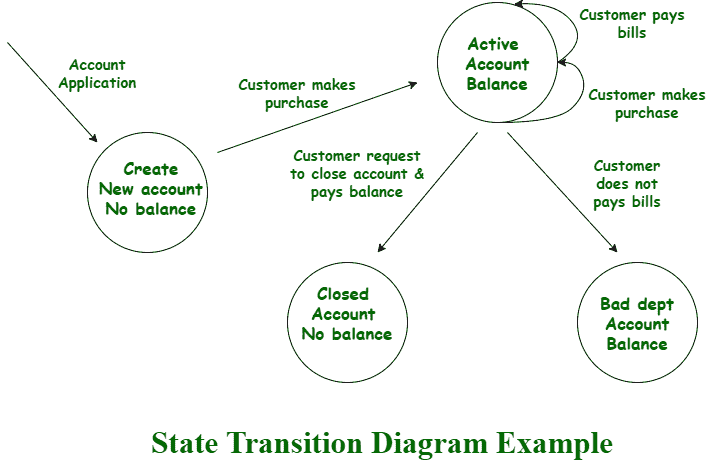
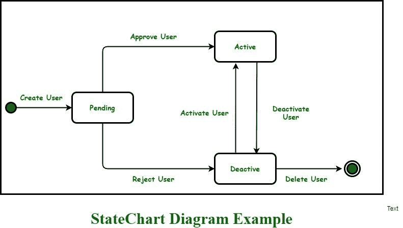

# 结构化分析和面向对象分析的区别

> 原文:[https://www . geesforgeks . org/结构化和面向对象分析之间的区别/](https://www.geeksforgeeks.org/difference-between-structured-and-object-oriented-analysis/)

分析简单的意思是详细地、有条不紊地研究或检查事物的结构、要素、系统需求。结构化分析和面向对象分析对于软件开发都很重要，并且是软件工程中使用的分析技术。但两者又各不相同。

**1。** [**【结构化分析】**](https://www.geeksforgeeks.org/structured-analysis-and-structured-design-sa-sd/) **:**
结构化分析是一种开发方法，它允许并允许分析师以逻辑方式理解和了解系统及其所有活动。它只是一个图形，用于指定应用程序的表示。

**示例–**

**2。** [**【面向对象分析】**](https://www.geeksforgeeks.org/object-oriented-analysis-and-design/) **:**
面向对象分析(OOA)是一种技术方法，通常用于分析和应用程序设计、系统设计，甚至业务设计，只需应用面向对象编程，甚至在整个开发过程中使用可视化建模，只需简单地指导利益相关者的沟通和产品质量。它实际上是一个发现的过程，开发团队理解并建模系统的所有需求。

**示例–**

**结构化分析和面向对象分析的区别:**

<figure class="table">

| 结构分析 | 面向对象分析 |
| 主要关注系统的流程和程序。 | 主要集中在重要的数据结构和现实对象上。 |
| 它将系统开发生命周期(SDLC)方法用于不同的目的，如规划、分析、设计、实施和支持信息系统。 | 它使用增量或迭代方法来改进和扩展我们的设计。 |
| 它适用于用户需求稳定的定义明确的项目。 | 适用于用户需求不断变化的大型项目。 |
| 使用这种分析技术的风险很高，可重用性也很低。 | 使用这种分析技术的风险很低，可重用性也很高。 |
| 结构化需求包括 DFDs(数据流图)、结构化英语、ER(实体关系)图、CFD(控制流图)、数据字典、决策表/树、状态转移图。 | 需求工程包括用例模型(查找用例、事件流、活动图)、对象模型(查找类和类关系、对象交互、对象到 ER 的映射)、状态图和部署图。 |
| 这种技术已经很老了，通常不是首选。 | 这项技术是新的，也是首选。 |

</figure>