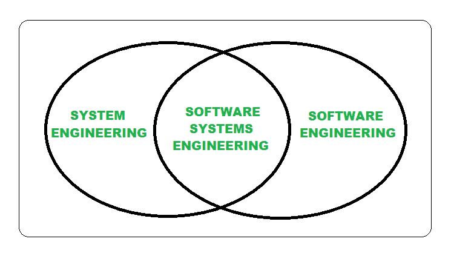

# 系统工程师和软件工程师的区别

> 原文:[https://www . geesforgeks . org/系统工程师和软件工程师的区别/](https://www.geeksforgeeks.org/difference-between-system-engineer-and-software-engineer/)

**1。系统工程师:**
系统工程师是指在工程项目的生命周期中对其进行全面管理的人(更侧重于物理方面)。他们遵循跨学科的方法来管理将需求转化为解决方案所需的全部技术和管理工作。他们通常关注基于计算机的系统开发的所有方面，不仅如此，还有硬件、软件和过程工程等。包括在内。

**系统工程方法:**

*   利益相关者分析
*   接口规范
*   设计权衡
*   结构管理
*   系统验证和确认
*   需求工程

**2。[软件工程师](https://www.geeksforgeeks.org/how-to-become-a-software-engineer/) :**
软件工程师是设计和开发高质量软件应用程序/软件产品的人。他们遵循软件应用程序的软件设计、开发、部署和维护的系统和规范的方法。他们通常关心系统中软件开发、基础设施、控制、应用和数据库的所有方面。

**软件工程方法:**

*   过程建模
*   增量验证和确认
*   过程改进
*   模型驱动开发
*   敏捷方法
*   连续累计

**系统工程师和软件工程师的区别:**

| 没有。 | 系统工程师 | 软件工程师 |
| 01. | 系统工程师是在工程项目的生命周期中处理工程项目的整体管理的人(更关注物理方面)。 | 软件工程师是负责设计和开发高质量软件应用程序/软件产品的人。 |
| 02. | 系统工程师遵循跨学科的方法，管理将需求转化为解决方案所需的全部技术和管理工作。 | 软件工程师在软件应用程序的软件设计、开发、部署和维护方面遵循系统和规范的方法。 |
| 03. | 一般来说，他们关心基于计算机的系统开发的所有方面，包括硬件、软件和过程工程。 | 一般来说，他们关心系统中软件开发、基础设施、控制、应用和数据库的所有方面。 |
| 04. | 软件工程可以从系统工程中学到一件事，即考虑权衡和使用框架方法。 | 系统工程可以从软件工程中学到一件事，即成本估算的严格方法。 |
| 05. | 系统工程师主要关注用户和域。 | 软件工程师大多专注于开发好的软件。 |
| 06. | 系统工程方法包括利益相关者分析、接口规范、设计权衡、配置管理、系统验证和确认、需求工程等。 | 软件工程方法有建模、增量验证和确认、过程改进、模型驱动开发、敏捷方法、持续集成等。 |
| 07. | 它确保正确的外部接口，子系统和软件之间的接口。 | 它使软件模块、数据和通信路径之间的接口工作。 |
| 08. | 系统工程师需要更广泛的教育背景，如工程、数学和计算机科学等。 | 而软件工程师需要计算机科学或计算机工程背景。 |

但这两个学科是相互关联的，在信息技术行业，这些头衔有如此严格的规则，我们也可以看到这两个学科是如何相互合作的。