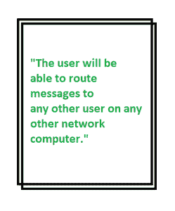
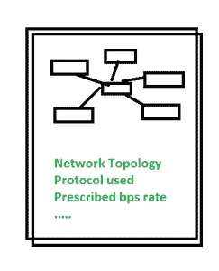
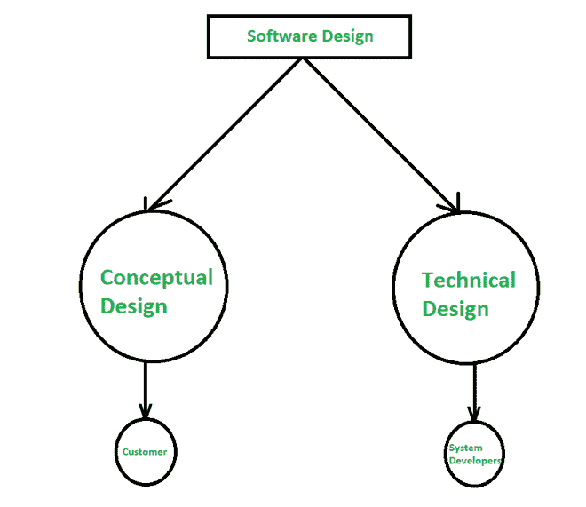

# 软件工程中技术设计与概念设计的区别

> 原文:[https://www . geesforgeks . org/技术设计与软件工程概念设计的区别/](https://www.geeksforgeeks.org/difference-between-technical-design-and-conceptual-design-in-software-engineering/)

**什么是软件设计？**
软件设计是将用户需求转化为客户端需求用户界面形式的过程，帮助软件开发者进行编码和实现。软件设计涉及将[软件需求规范(SRS)文档](https://www.geeksforgeeks.org/software-engineering-parts-of-a-srs-document/)中描述的客户需求描绘成用户界面形式。

为了将需求转化为工作系统，设计者必须同时满足客户和系统构建者。客户应该了解系统试图做什么。与此同时，系统构建者必须了解如何尝试。为了完成设计被分成两部分，如下图所示，并被命名为 2 部分迭代过程。软件设计有两个部分:

**1。概念设计:**
概念设计是规划过程中的一个初始/开始阶段，在此期间，功能和某种东西的大致轮廓是耦合的。它告诉客户系统实际上会做什么。下图给出了一个概念设计的例子:

概念设计

**2。技术设计:**
技术设计是活动团队编写代码并描述整个设计或部分设计的细节的阶段。它告诉设计者系统实际上会做什么。下图给出了一个技术设计示例:

技术设计

软件设计

**概念设计与技术设计的区别:**

<figure class="table">

| **概念设计** | **技术设计** |
| 概念设计是规划过程中的一个初始/开始阶段，在此期间，功能和某种东西的大致轮廓是耦合的。 | 技术设计是一个阶段，在这个阶段，事件团队编写代码并描述整个设计或部分设计的细节。 |
| 它用客户的语言编写，并根据客户的要求进行设计。 | 它描述了将需求转化为客户问题的解决方案的任何其他事情。 |
| 它描述了系统中的数据会发生什么。 | 它描述了系统的功能或方法。 |
| 它展示了概念模型，即系统应该是什么样子。 | 它显示了数据流和数据结构。 |
| 除了策略之外，还包括流程和子流程。 | 它包括概念设计的功能和工作。 |
| 当一个系统需求出现时，这个阶段就开始寻找潜在的解决方案。 | 它在设置系统要求后开始。 |
| 在此阶段结束时，问题的解决方案将被发送以供审查。 | 在这个阶段结束时，在分析了技术设计之后，开始规范。 |

</figure>