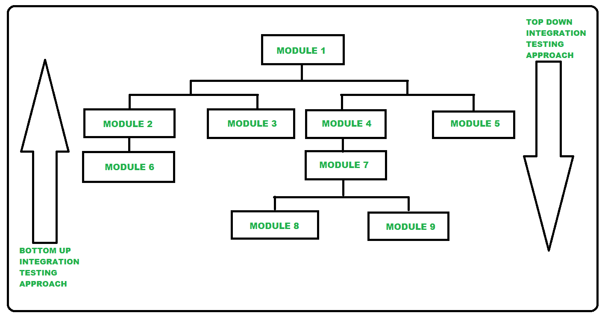

# 自上而下和自下而上集成测试的区别

> 原文:[https://www . geesforgeks . org/区别-自上而下和自下而上-集成-测试/](https://www.geeksforgeeks.org/difference-between-top-down-and-bottom-up-integration-testing/)

先决条件–[集成测试](https://www.geeksforgeeks.org/software-engineering-integration-testing/)

**1。自顶向下集成测试:**
自顶向下集成测试，也称为增量集成测试。在这种自上而下的方法中，先测试较高级别的模块，然后再测试较低级别的模块。然后这些模块进行相应的集成。这里上级模块指的是主模块，下级模块指的是子模块。这种方法使用 Stub，Stub 主要用于模拟子模块，如果调用的子模块没有开发出来，这个 Stub 作为一个暂时的替代。

**2。自下而上的集成测试:**
自下而上的集成测试是集成测试的另一种方法。在这种自下而上的方法中，先测试较低级别的模块，然后再测试较高级别的模块。然后这些模块进行相应的集成。这里下级模块指的是子模块，上级模块指的是主模块。这种方法使用测试驱动程序，主要用于启动所需数据并将其传递给子模块，这意味着如果需要，可以从较高级别的模块传递给较低级别的模块。

下图**代表自上而下和自下而上的集成测试方法。**

****

 ****自上而下集成测试和自下而上集成测试的区别:****

| 没有。 | 自顶向下集成测试 | 自下而上的集成测试 |
| 01. | 自顶向下集成测试是集成测试的方法之一，其中集成测试从上到下进行意味着系统集成从顶层模块开始。 | 自下而上集成测试是集成测试的方法之一，其中集成测试从下往上进行意味着系统集成从最底层的模块开始。 |
| 02. | 在这个测试中，首先测试较高级别的模块，然后测试较低级别的模块，然后相应地集成这些模块。 | 在这个测试中，首先测试较低级别的模块，然后测试较高级别的模块，然后相应地集成这些模块。 |
| 03. | 在这个测试中，存根用于模拟子模块，如果调用的子模块没有开发出来，意味着存根作为一个暂时的替代。 | 在本测试中，驱动程序用于模拟主模块，如果主模块未开发，则意味着驱动程序作为临时替代。 |
| 04. | 如果重大缺陷发生在程序的顶部，自顶向下的集成测试方法是有益的。 | 如果关键的缺陷在程序的底部遇到，自下而上的集成测试方法是有益的。 |
| 05. | 在自顶向下集成测试方法中，首先设计主模块，然后从中调用子模块/子程序。 | 在自底向上集成测试方法中，首先创建不同的模块，然后将这些模块与主要功能集成在一起。 |
| 06. | 它是在面向结构/过程的编程语言上实现的。 | 它是在面向对象编程语言上实现的。 |
| 07. | 这个测试的复杂性很简单。 | 这种测试的复杂性是复杂的，并且是高度数据密集型的。 |
| 08. | 它适用于从大到小的组件。 | 它适用于小到大的组件。 |
| 09. | 在这种方法中，必须产生存根模块。 | 在这种方法中，必须生产驱动模块。 |