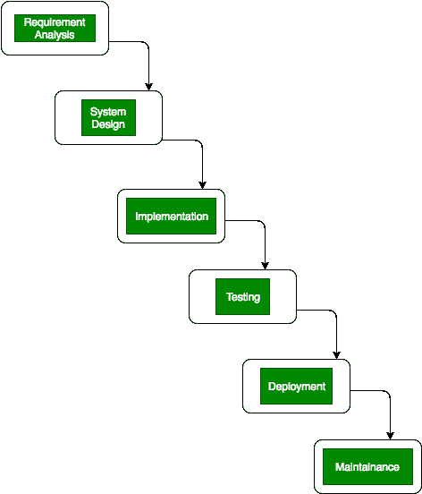
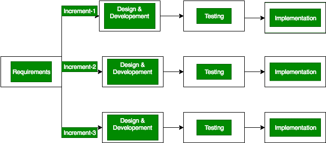

# 瀑布模型和增量模型的区别

> 原文:[https://www . geesforgeks . org/瀑布模型和增量模型的区别/](https://www.geeksforgeeks.org/difference-between-waterfall-model-and-incremental-model/)

[瀑布模型](https://www.geeksforgeeks.org/software-engineering-classical-waterfall-model/)又称**古典/传统模型**。有时它被称为线性顺序生命周期模型，因为该模型中涉及的所有阶段都以线性方式逐个完成。在这个模型中，我们在完成所有编码阶段后得到软件。这种模式基本上用于小型项目。瀑布模型中只有一个循环。

**Figure –** Waterfall Model

而在[增量模型](https://www.geeksforgeeks.org/software-engineering-incremental-process-model/)中，多个开发周期发生，这些周期被分成更多更小的模块。一般来说，增量模型中的工作软件是在第一个模块中产生的，该模块的每个后续版本都会在前一个版本的基础上增加功能。在增量模型中，过程一直持续到完成整个系统。

**Figure –** Incremental Model

Here we will see that how waterfall model is different from an incremental model in terms of time, cost, maintenance, documentation etc. Some differences between them are given below:

| 瀑布模型 | 增量模型 |
| --- | --- |
| 瀑布模型需要详细的文档。 | 增量模型中需要详细的文档是必要的，但不要太多。 |
| 在瀑布模型中，早期规划是必要的。 | 在增量模型中，早期规划也是必要的。 |
| 瀑布模型存在较高的金额风险。 | 增量模型存在较低的金额风险。 |
| 瀑布模型运行软件等待时间长。 | 增量模式下运行软件等待时间短。 |
| 瀑布模型无法处理大型项目。 | 增量模式也处理不了大项目。 |
| 瀑布模型的灵活性很难改变。 | 增量模型中的灵活性很容易改变。 |
| 瀑布模型成本低。 | 增量模式的成本也很低。 |
| 在完成所有编码阶段后，测试在瀑布模型中完成。 | 在每个阶段的迭代之后，测试都在增量模型中完成。 |
| 不可能返回到瀑布模型中的前一阶段/阶段。 | 在增量模型中返回到前一阶段/阶段是可能的。 |
| 在瀑布模型中，需要大型团队。 | 在增量模型中，不需要大型团队。 |
| 在瀑布模型中，阶段重叠是不可能的。 | 在增量模型中，阶段重叠是可能的。 |
| 瀑布模型只有一个周期。 | 增量模型中有多个开发周期。 |

