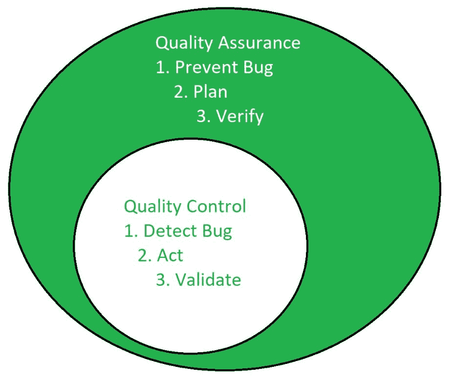

# 质量保证和质量控制的区别

> 原文:[https://www . geesforgeks . org/质量保证和质量控制之间的差异/](https://www.geeksforgeeks.org/differences-between-quality-assurance-and-quality-control/)

**质量保证:**
质量保证是使软件应用程序在最终发布给最终用户时缺陷和错误更少的一种方法。
质量保证被定义为确保为项目设计的方法、技术、方法和过程得到正确实施的活动。它能识别过程中的缺陷。质量保证在质量控制之前完成。

**质量控制:**
质量控制是一个软件工程过程，用于确保项目中设计的方法、技术、方法和过程得到正确遵循。质量控制活动运行并验证应用程序符合规定的质量标准。

它侧重于检查最终产品的质量和最终结果，而不是侧重于用于创建产品的过程。

以下是质量保证和质量控制之间的区别:

| 质量保证 | 质量控制 |
| --- | --- |
| 它的重点是保证达到要求的质量。 | 它侧重于满足质量要求。 |
| 这是管理质量的技巧。 | 这是检验质量的技术。 |
| 它不包括程序的执行。 | 它总是包括程序的执行。 |
| 它是一种管理工具。 | 这是一个纠正工具。 |
| 它是面向过程的。 | 它是面向产品的。 |
| 质量保证的目的是防止缺陷。 | 质量控制的目的是识别和改进缺陷。 |
| 这是一种预防技术。 | 这是一种矫正技术。 |
| 这是一项积极的措施。 | 这是一种被动措施。 |
| 它负责整个软件开发生命周期。 | 它负责软件测试生命周期。 |
| 示例:验证 | 示例:验证 |

