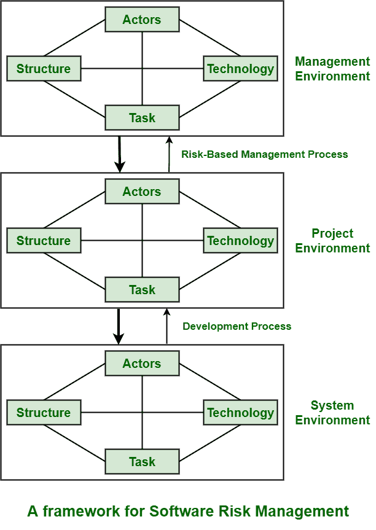

# 软件开发中不同类别的风险

> 原文:[https://www . geesforgeks . org/不同类别的软件开发风险/](https://www.geeksforgeeks.org/different-categories-of-risk-in-software-development/)

**风险**简单代表损失和伤害的可能性。这是一个可能会意外发生并对我们的项目造成影响的事件。它可以对项目产生积极或消极的影响。它可以影响任何东西，包括人员、流程、技术，甚至资源。它只是专注于确定、识别、评估或评价项目的风险。它还管理这些风险，以总体上减少对项目的影响。

在分层软件开发模型的背景下，我们得到了如下所示的框架:

非常简单，一般，全面。Lyytinen 等人提出了风险的社会技术模型。风险被分为如下所示的其他方式:

*   **Actors :**
    Project actors cover all people or stakeholders that are involved in development process and even can set forward claims to or benefit from project. Therefore, all persons that are participating, even groups, and all other stakeholders along with customers, users, maintainers, development groups are needed and essential to be included in this set. The risk in this area is that high staff turnover that generally leads to information of value to project that is being lost. Actors have many features that have an impact on project risks like knowledge and skills, experience, expectations and commitments, and even beliefs and values. All of these features simply vary from one actor to another.
*   **Technology :**
    The project technology generally contains or includes methods that are available, tools, and infrastructure to simply design software system and then to implement it. It usually around both technology that is used to implement application and that further fixed firmly in product being delivered. Example of such technology includes software development method, quality assurance systems, computers, etc. Here, risk is generally related to appropriateness of technologies and to possible fault this is present between them. All technological shortcomings and even dynamic nature of technology are true sources of risk.
*   **Structure :**
    This component generally helps in describing and explaining management structure of software system. They also refer to systems of communication, authority, and also workflow. Risks come to be known and revealed when actors do not communicate in an effective way or manner. Another reason can be that appropriate actors are involved in communication or when scope of communication is often limited. The structure is needed to be organized to provide and give adequate and reliable information or data. The risk profile simply changes when workflow structure does not match with given task.
*   **任务:**
    任务只是与需要执行的工作相关。每个盒子都连接到所有剩余的盒子。每个人都必须了解项目任务。任务只是在给定的时间和成本限制内，根据利益相关者或客户的期望来执行。仅仅通过改变软件系统的重要组成部分就可以建立和实现一个新的软件系统。