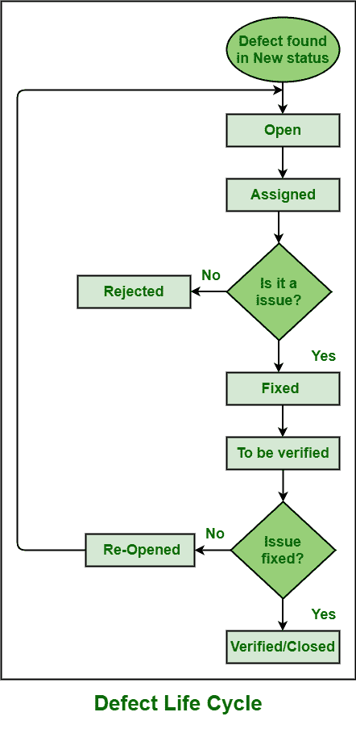

# 缺陷生命周期中可用的不同缺陷状态

> 原文:[https://www . geeksforgeeks . org/不同缺陷状态-缺陷生命周期中可用/](https://www.geeksforgeeks.org/different-defect-states-available-in-defect-life-cycle/)

**[缺陷生命周期](https://practice-stage.geeksforgeeks.org/problems/what-is-defect-lifecycle)** ，也称为 bug 生命周期，是一个不同阶段的生命周期，从软件测试人员发现缺陷或 Bug 的那一刻起，直到测试人员宣布特定的缺陷已经完全解决并且永远不会再重现，缺陷或 Bug 就这样通过或消失了。

**不同的缺陷状态:**
缺陷生命周期基本上由各种阶段或状态组成，通过这些阶段或状态，缺陷被解决，测试缺陷，并遵循过程直到缺陷没有被解决。这些阶段如下:

1.  **新:**
    每当测试人员第一次识别并公布缺陷时，它会自动被指定为“新”状态。

*   **Open :
    测试团队随后审查缺陷，并确保所识别的缺陷是否有效。如果缺陷有效，那么它会自动被指定为“打开”状态。***   ****分配:**
    缺陷随后由测试负责人进一步分配给开发团队。然后它会被自动分配一个“已分配”状态。现在，分析缺陷并解决它是开发人员的责任。

    *   **重复–**
        如果开发人员在分析过程中发现缺陷被发布了不止一次，或者两个缺陷的缺陷报告具有相似的结果和重现步骤，或者它对应于相同的缺陷概念，那么它被自动分配为“重复”状态。
    *   **被拒绝–**
        如果开发人员在分析过程中发现缺陷不真实、不有效或未通过认证，那么它将自动被指定为“被拒绝”状态。
    *   **延期/延期–**
        如果开发人员在分析过程中发现缺陷对系统的危害不是很大，也不是首要的优先事项，并且可以在下一个版本中修复，那么会自动分配一个状态为“延期”。
    *   **不可重现–**
        如果开发人员在分析过程中发现缺陷没有按照测试线索在缺陷报告中的“重现步骤”中已经提到的步骤重现，那么它将自动被指定为“不可重现”状态。** *   ****修复:**
    当开发人员的完成者完成了分析过程，发现缺陷是有效的，需要立即修复时，开发人员进行所需的更改来解决缺陷。进行更改后，开发人员进一步验证更改。如果不需要其他改变来扩散缺陷，那么它被自动分配一个状态为“已修复”。***   ****已验证:**
    开发人员随后进一步将缺陷传递给测试团队进行再次验证，然后自动将其分配为“重新测试”状态，即“待验证”。测试人员在这里检查缺陷是否被开发人员修复。

    *   **重新开启–**
        在重新测试或验证时，如果测试人员发现缺陷没有完全修复，并且可以再次重现或没有正确修复，则自动将其分配为“重新开启”状态。在这种情况下，缺陷被进一步重新打开。** *   ****关闭:**
    如果测试团队发现缺陷不再存在，并且没有发现任何能够再次重现的缺陷痕迹，那么它会自动被指定为“关闭”状态。**