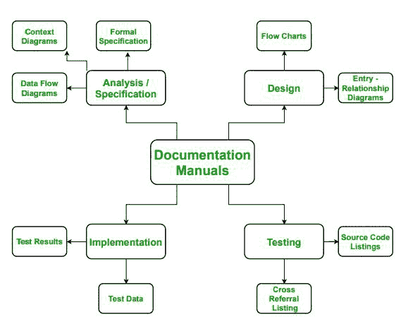

# 软件工程中不同的文档手册

> 原文:[https://www . geesforgeks . org/different-documentation-manuals-in-software-engineering/](https://www.geeksforgeeks.org/different-documentation-manuals-in-software-engineering/)

**软件工程中的文档**就像一把伞，包括软件产品开发和使用所需的所有书面文档和材料。

有四种不同类型的文档手册。每个文档手册都是在软件开发的不同阶段准备的。

**文件分类手册:**

**1。分析/规范手册:**
本手册在软件开发的分析阶段编写。在本手册中，描述了规定软件要求的所有信息。本手册中的信息如下所示:

*   **正式规范–**
    在此，对软件的所有需求进行了详细描述。
*   **上下文图–**
    该图描述了软件的上下文。
*   **数据流图–**
    数据流图是软件内部信息流的可视化表示。

**2。设计手册:**
在本手册中，所有关于软件设计和软件外观的信息。本手册由以下内容组成:

*   **流程图–**
    它是表示软件工作过程的可视化表示。
*   **实体关系图–**
    这是一种流程图，说明了诸如人、对象等“实体”如何。

**3。实施手册:**
本手册在软件开发的开发阶段编写。在本手册中，关于软件中使用的程序代码、算法和数据结构的所有信息。本手册由以下内容组成:

*   **源代码列表–**
    它描述了为该软件开发的代码。
*   **交叉引用列表–**
    描述代码模块的引用。

**4。测试手册:**
本手册在软件测试阶段编写。测试仪用于检查软件功能的最佳和最差情况，并存储结果。本手册由以下内容组成:

*   **测试数据–**
    这些是在软件中作为处理任务的输入的数据。
*   **测试结果–**
    这些数据是软件为所提供的测试数据产生的输出。