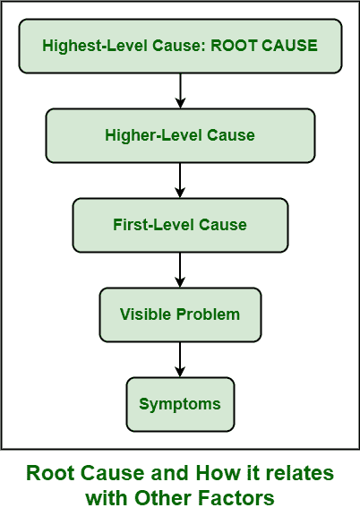

# RCA 中不同级别的原因

> 原文:[https://www . geeksforgeeks . org/RCA 中不同级别的原因/](https://www.geeksforgeeks.org/different-levels-of-causes-in-rca/)

在[根本原因分析(RCA)](https://www.geeksforgeeks.org/basic-principle-of-root-cause-analysis/) 中，不一定会只有问题的根本原因。缺陷或问题的根本原因或真正原因可能不止一个。这是一种非常罕见的情况，一个问题只有一个原因。

然而，主要的焦点只集中在导致问题或缺陷的一个主要原因上。原因可能存在于不同的层面。有许多原因会影响导致问题或缺陷的其他原因。原因可分为以下几类–

 

*   **症状:**
    症状是可以被认为是缺陷或问题的迹象的身体特征。这也可以看作是一个问题的证据。简单来说，就是存在问题的特征标志。不同的原因有不同的影响和症状。人们可以通过检查症状来确定问题。但是类似症状的一些原因。

*   **问题:**
    问题一般被认为是一种有害的、造成各种困难的情况。这种情况需要处理、解决和克服。这通常是流程执行方式和实际执行方式之间的区别。这些不同基本上是由于需要解决的问题而产生的。*   **一级原因:**
    一级原因被认为是导致问题或缺陷的原因。这直接导致问题的发生。它不需要任何中间原因来引发问题。它本身会导致一个问题。*   **更高级别的原因:**
    更高级别的原因可以被认为是中间原因，因为它们不直接导致或引起问题。这些原因导致一级原因，进而导致缺陷或问题。这种原因只是在因果关系链中形成一个环节或联系，进而导致问题或缺陷。*   **最高级原因:**
    最高级原因被认为是问题的根本原因，是问题的真实或真实原因。需要尽快解决这些原因，以便最小化或减少特定问题再次发生时的变化。