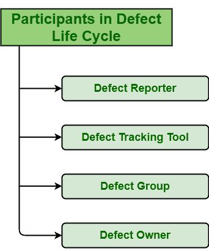

# 缺陷生命周期的不同参与者

> 原文:[https://www . geeksforgeeks . org/缺陷生命周期的不同参与者/](https://www.geeksforgeeks.org/different-participants-of-defect-life-cycle/)

**[【缺陷生命周期】](https://practice-stage.geeksforgeeks.org/problems/what-is-defect-lifecycle)** 通常因组织而异，并由[软件测试](https://www.geeksforgeeks.org/software-testing-basics/)管理和控制，该软件测试是组织或项目遵循的过程或通常使用的缺陷跟踪工具。缺陷生命周期有不同的参与者，他们使过程成功。这些参与者如下:

1.  **缺陷报告人:**
    缺陷报告人，顾名思义就是报告缺陷的人，也就是认定缺陷的人。缺陷报告员的主要作用只是验证，即检查和证明缺陷的有效性或准确性。验证后，报告者将与缺陷相关的所有细节和信息输入缺陷跟踪工具。这些细节和信息可能包括[缺陷优先级](https://www.geeksforgeeks.org/defect-priority/)、[缺陷严重性](https://www.geeksforgeeks.org/defect-severity/)、缺陷影响、测试环境、缺陷描述、模块、缺陷类型、修复所需资源、再现步骤等。测试人员有时需要发送附带的截图，以确保和澄清缺陷的所有细节。
2.  **缺陷跟踪工具:**
    缺陷跟踪工具，顾名思义，就是用来识别或跟踪缺陷的工具。它通常有助于记录、报告、分配、识别、发现和跟踪软件开发项目中存在的缺陷。简单来说，我们可以说更好的是 bug 跟踪工具，更好的会是产品质量。缺陷通常记录在缺陷跟踪工具中，通常有助于报告。这些工具可以是吉拉、汇编等。
3.  **缺陷组:**
    缺陷组，顾名思义，就是被允许看到缺陷相关全部细节的一群人。缺陷组通常负责与缺陷相关的每项活动，从识别缺陷开始，直到解决缺陷。这些小组可能包括识别和验证缺陷的测试人员、管理测试人员和缺陷报告的测试负责人、报告缺陷的最终用户、测试负责人指派给缺陷的开发人员、项目经理、质量保证经理、质量保证团队等。简单来说，缺陷组就是一群可以观看缺陷所有活动的人。
4.  **缺陷责任人:**
    缺陷责任人，顾名思义，就是负责审查并拥有缺陷的人。他/她通常负责检查、验证并确保所提供的与缺陷相关的信息是否完整和充分。如果提供的信息不完整且不充分，则缺陷被分配回报告缺陷的缺陷报告者，以向其添加更多的附加信息。根据分配给每个缺陷的优先级，缺陷所有者然后在期限内进一步解决和修复缺陷。