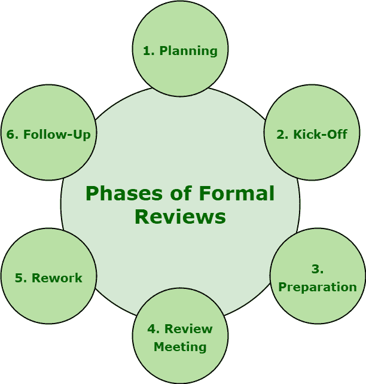

# 正式评审的不同阶段

> 原文:[https://www . geesforgeks . org/不同阶段的正式审查/](https://www.geeksforgeeks.org/different-phases-of-formal-review/)

**正式评审**通常以零敲碎打的方式进行，包括六个必要的不同步骤。正式评审一般遵循正式流程。这也是静态测试中最重要和最基本的技术之一。

六个步骤极其重要，因为它们允许开发团队简单地确保和检查软件质量、效率和有效性。这些步骤如下:

1.  **策划:**
    对于具体评审，评审流程一般以作者向版主或评审组长简单的‘要求评审’开始。个人参与者根据他们对文档和角色的理解，简单地识别和确定缺陷、问题和评论。主持人还会执行进入检查，甚至考虑退出标准。

*   **Kick-Off :**
    Getting everybody on the same page regarding document under review is the main goal and aim of this meeting. Even entry result and exit criteria are also discussed in this meeting. It is basically an optional step. It also provides better understanding of team about relationship among document under review and other documents. During kick-off, Distribution of document under review, source documents, and all other related documentation can also be done.*   **Preparation :**
    In preparation phase, participants simply work individually on document under review with the help of related documents, procedures, rules, and provided checklists. Spelling mistakes are also recorded on document under review but not mentioned during meeting.

    这些审查者通常会识别并确定，还会检查任何缺陷、问题或错误，并提供他们的意见，这些意见随后会在记录表的帮助下在审查文档时进行合并和记录。

    *   **Review Meeting :**
    This phase generally involves three different phases i.e. logging, discussion, and decision. Different tasks are simply related to document under review is performed.*   **Rework :**
    Author basically improves document that is under review based on the defects that are detected and improvements being suggested in review meeting. Document needs to be reworked if total number of defects that are found are more than an unexpected level. Changes that are done to document must be easy to determine during follow-up, therefore author needs to indicate changes are made.*   **Follow-Up :**
    Generally, after rework, moderator must ensure that all satisfactory actions need to be taken on all logged defects, improvement suggestions, and change requests. Moderator simply makes sure that whether author has taken care of all defects or not. In order to control, handle, and optimize review process, moderator collects number of measurements at every step of process. Examples of measurements include total number of defects that are found, total number of defects that are found per page, overall review effort, etc.