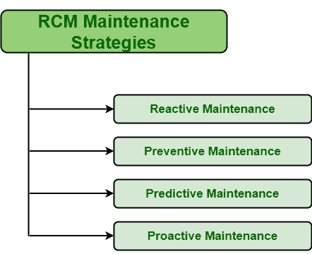

# 不同的 RCM 维护策略

> 原文:[https://www . geesforgeks . org/different-RCM-维护-策略/](https://www.geeksforgeeks.org/different-rcm-maintenance-strategies/)

**以可靠性为中心的维护(RCM)** 是一种主要关注提供安全性的方法。它只是确保在需要时对特定设备应用正确的维护策略。选定的维护策略应该能够提供安全性，并且必须具有成本效益。人们需要分析哪种维护策略是最合适和必需的。RCM 团队对维护策略选择的决策基于几个因素，如经验、预定义的逻辑图、成本效益和其他因素。

**不同的 RCM 维护策略:**
基本上有四种维护策略可以用于不同的系统。系统特定维护策略的选择基于几个因素，如成本、故障的潜在后果、经验等。下面给出了这四种维护策略:

1.  **反应性维护:**
    反应性维护是一种维护策略，在资产(即系统的设备或组件)已经发生故障时应用。有几种故障不太严重，对系统影响较小，不会造成太大危害，因此发生后可以修复。这种故障可以在故障发生后修复。在这种情况下，系统被允许运行，直到出现故障。故障发生后，这种反应式维护策略应用于系统，只是为了修复特定设备并将其恢复到正常状态。这个策略很划算。这种策略也被称为运行至故障维护、故障时修复维护、维修维护、故障维护。

*   **预防性维护:**
    预防性维护是一种定期应用于资产的维护策略，以最大限度地减少或减少故障发生的机会。这一策略要求定期维护设备，必要时更换设备。这适用于设备仍在工作时，以减少其故障的机会。通过应用这种策略，人们可以保持设备运行，通过消除故障发生的机会来降低维修成本。*   **预测性维护:**
    预测性维护，顾名思义，是一种预测系统或设备故障几率的维护策略。在预测到故障后，可以更换或维修设备，在设备故障前实施适当的计划。人们还可以重新设计系统，以减少或消除故障风险。在这种策略中，定期监控设备的状况，以检查故障的可能性。*   **主动维护:**
    主动维护是一种维护策略，通常针对故障的根本原因，简单地避免故障发生的机会。这与被动维护正好相反。它在任何故障发生之前执行。在这种方法中，故障的根本原因被识别，然后采取正确的行动或措施来减少或最小化故障发生的机会。根本原因是导致故障发生的不想要的原因。确定根本原因后，需要确定适当的预防措施。它只是提供持续的改进过程。它还使用根本原因故障分析和预测分析来提高维护效率。