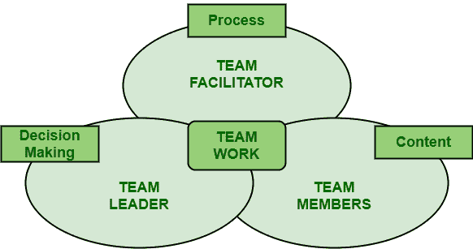

# RCA 团队的不同角色

> 原文:[https://www.geeksforgeeks.org/different-roles-of-rca-team/](https://www.geeksforgeeks.org/different-roles-of-rca-team/)

[根本原因分析(RCA)](https://www.geeksforgeeks.org/basic-principle-of-root-cause-analysis/) 团队基本上是一组个人，他们拥有关于正在检查的过程的所有知识和信息。他们通常负责对导致组织成长和提高软件质量的缺陷采取纠正决策和措施。他们还负责实施能带来永久结果的纠正措施。

他们应该遵循有效的 [RCA](https://www.geeksforgeeks.org/advantages-and-disadvantages-of-root-cause-analysis/) 所需遵循的步骤。

**RCA 团队的角色:**
RCA 团队有不同的角色，分类如下。

1.  **团队领导–**
    团队领导，顾名思义，负责做出与缺陷相关的决策，以获得更好、更有效的结果。他们基本上拥有缺陷或问题。他们的主要目标是管理和控制其他团队成员，并专注于内容。他们只需要提高软件的生产率和质量。他们还负责为团队的其他成员提供指导、指示、方向和领导，以实现目标。他/她监督系统的整体功能。
2.  **团队促进者–**
    团队促进者顾名思义，负责促进、帮助团队其他成员以更高效的方式一起工作、计划如何实现目标、关注流程等。他/她基本上支持和重新激励团队的其他成员。他们还负责确保正确实施所有必要的方法和技术。管理团队和指导其他成员需要团队协调人。他还确保所有其他团队成员了解他们的职责和任务完成情况。团队协调者也被称为首席分析师，他只是负责促进和协调 RCA。
3.  **团队成员–**
    团队成员，顾名思义，就是参与团队以实现特定目标或目的的人。所有团队成员都应该充分了解自己的职责和任务，也应该意识到自己的优势和劣势。团队成员也被称为分析团队成员，是 RCA 团队的成员。每个团队成员都被允许分享他们的想法和经验，以获得更好的结果。他们的主要职责是帮助团队领导和促进者实现目标或指标。他们也帮助顾客找到想要的商品和服务。