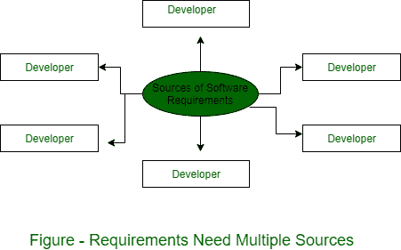

# 理解软件需求的不同来源

> 原文:[https://www . geesforgeks . org/different-理解来源-软件-需求/](https://www.geeksforgeeks.org/different-sources-of-understanding-software-requirements/)

软件的需求规格说明为开发系统提供了基础，这是 [SDLC](https://www.geeksforgeeks.org/software-development-life-cycle-sdlc/) 中最关键的步骤之一。虽然涉众是需求的最终来源，但是您不能依赖于单一来源所陈述的规范。

对于单一来源的需求，几乎不可能对规范进行验证，因为不会对来自各种来源的规定专业进行可比检查，这些来源包括客户、消费者、问题领域专家、关联领域专家、潜在用户、运营商、经验丰富的开发人员，甚至系统的批评者。一组知识数据产生于现有的手动或半自动系统的执行。

来自所有者、用户、操作员和其他工人的反馈。受益者也被收集起来，他们对新系统的建议和期望被记录下来。收集的数据经过集体评估和提炼，并与相关人员协商。

1.  **Stakeholders/Buyers :**
    They are the persons responsible for accepting and executing the software. They can be individual individuals, organizations, trusts or even the government or public of a country.
2.  **User/Beneficiaries :**
    These are the users of the product for which the product is intended.
3.  **Operators :**
    They are the persons who work on the software to make the services of the software available to its beneficiaries or the end users.
4.  **Domain experts :**
    They are professionals with experience and expertise of the domain in which the software provides its services, viz. insurance, financials, banking, communication, data transfer, networking, etc. Domain experts unwind the hidden or unseen probable requirements or risks involved in product development.

5.  **Developer :**
    The software engineering responsible for developing the software to make it provide the expected services. They are responsible for software design, prototype development, and technical feasibility. They work closely with the end-users, buyers, and application experts.
6.  **Automated Tools :**
    In the new generation of information technology and software development paradigm, many automated and semi-automated tools are available that allow for the affirmation and management of the need for building the system. such software also provides input. System/software requirements.
7.  **Past Experience/Case Studies :**
    An organization working in the similar or same domain may provide its past experience or even documented case studies. This helps have a clearer picture of the requirements, which may otherwise be left hidden.
8.  **Connected People/Machine/Environment :**
    People associated with software or environmental factors and IT domain may give a lot of provide information about constraints involved in development, development, its and environment implications on software.
9.  **测试人员:**
    测试人员是用户行为或系统状况预测行为的良好信息来源。持续接触真实用户的输入。在这种情况下，审查员可以利用他们的经验和分析技能来提供输入。