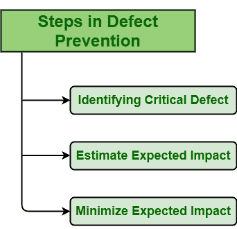

# 缺陷预防中涉及的不同步骤

> 原文:[https://www . geeksforgeeks . org/different-steps-介入缺陷预防/](https://www.geeksforgeeks.org/different-steps-involved-in-defect-prevention/)

**缺陷预防(DP)** 通常被认为是简单地防止缺陷在[软件开发生命周期(SDLC)](https://www.geeksforgeeks.org/software-development-life-cycle-sdlc/) 中再次发生的过程。在这里，缺陷基本上被定义为在 SDLC 的不同阶段可能发生的错误。在测试的早期阶段消除缺陷是最好的方法之一，而不是在后期阶段识别并解决它。

**DP 涉及的步骤:**
缺陷预防过程基本上有三个步骤，如下所示:

1.  **识别关键缺陷:**
    缺陷的识别是缺陷预防的主要部分之一。在 SDLC 过程中，会遇到不同类型的缺陷。每个缺陷对系统的影响不同。其中一些具有严重影响，即主要影响系统，一些不太严重，即对系统影响较小，一些对系统影响非常小，可以认为可以忽略不计。因此，尽快识别系统中关键的和更严重的缺陷是非常重要的。严重缺陷非常严重，对系统的影响更大，因为一旦发生，它们可能会停止整个系统的运行，或者在更大的层面上引起一些其他问题。因此，识别关键缺陷非常重要。

*   **预估预期影响:**
    预估缺陷对成本的预期影响也是缺陷预防的重要一环。每当在系统中遇到缺陷时，出现的主要问题是需要采取什么措施来解决它以及解决它所需的数量。更关键的缺陷是，解决它需要更多的努力和资源。因此，如果缺陷以某种方式遇到或发生，最好估计缺陷对成本的预期影响。之后，应该采取一些措施来尽量减少它们的发生。*   **Minimize Expected Impact :**
    After identifying and estimating impact of critical defects, one should take some measures actions to minimize or eliminate defects permanently before its occurrence. Minimizing expected impact is also important part of defect prevention. If one could not eliminate defect, then he/she should try to reduce possibility of its occurrence and its impact.

    **DP 的优势:**

    *   通过采取一些必要的措施，系统中的缺陷数量被减少或最小化。
    *   改进了为审查而开发的检查表。
    *   修复缺陷所需的工作量随着缺陷数量的减少而减少。
    *   通过采取一些措施防止缺陷再次发生，解决缺陷所需的成本被最小化，从而降低了生产的总成本。
    *   尽可能帮助软件无缺陷。
    *   提高软件产品的整体质量。
    *   通过备份测试过程和最小化解决错误所需的成本来改进软件过程。