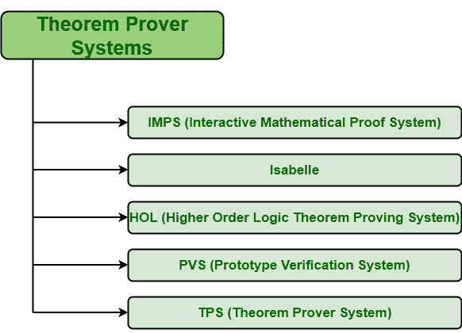

# 不同的定理证明系统(TPS)

> 原文:[https://www . geesforgeks . org/different-定理证明-系统-tps/](https://www.geeksforgeeks.org/different-theorem-proving-system-tps/)

**定理证明系统(TPS)** 也称为自动证明系统。应用于实时系统设计和验证的定理证明通常使用几种定义和不同的定理来基本上帮助设计、实现、验证和验证需求。这些证明方法还可以提供软件需求的更高级规范以及实现的详细描述。然后，可以对照规范检查这些实现，以确保其正确与否。自动定理证明通常集中在“识别”或“发现”方面。

**不同的定理证明系统:**
有许多定理证明系统是好的，并且与我们的工作相关。其中一些如下:

1.  **交互式数学证明系统(IMPS):**
    IMPS 的主要目的仅仅是为传统的数学推理技术提供机械化的支持。它还提供了大量的原始推理步骤，只是为了方便人类对演绎过程的控制和对结果证明的理解。它也是 PVS 的一个很强的替代方案，也可能是软件检查所需要的。IMPS 的逻辑也允许部分功能和通常未定义的术语。

*   **伊莎贝尔:**
    伊莎贝尔基本上是泛型证明助手或者泛型定理证明系统。它通常提供一个框架，在这个框架中，可以通过简单地指定各种逻辑的语法和推理规则来添加各种逻辑。它最初是在剑桥大学和慕尼黑工业大学开发的。它还提供了元逻辑，也称为弱类型理论，可用于编码对象逻辑，如一阶逻辑(FOL)、高阶逻辑(HOL)等。它也被认为是实现各种逻辑以及定义和检查奇异证明系统的工具。*   **高阶逻辑(HOL)定理证明系统:**
    HOL 定理证明器基本上是构造高阶逻辑中的 od 规范和形式证明的通用和最广泛使用的计算机程序。它还被用作一般定理证明研究的开放平台，简单来说就是一个形式化数学的平台。它还支持各种领域的推理，以及硬件设计和验证、关于实时系统的证明、编译器验证、程序正确性以及程序细化。目前基本上有四种不同的 HOL 系统被处理、维护和开发，即 HOL4 源于 HOL88 系统、HOL 之光、ProofPower 和 HOL Zero。它也被用作定理证明研究的平台。*   **原型验证系统(PVS) :**
    PVS 一般为正式规范和验证提供机械化支持。它通常是简单地编写规范和构造证明的原型系统。PVS 完全实现，免费提供。它还包括许多预定义的理论、定理证明器、不同的实用程序和文档。它的规范通常被组织成参数化的理论。它还提供了极具表现力和自然的规格。*   **定理证明系统(TPS) :**
    它基本上是作为高阶逻辑和一阶逻辑定理证明方法研究计划的一部分开发的。我们的工作可能需要 TPS，而不是 PVS，但是 PVS 更容易访问。它还包含公式编辑器，可以简单地从 TPS 已知的其他公式中构建新公式。