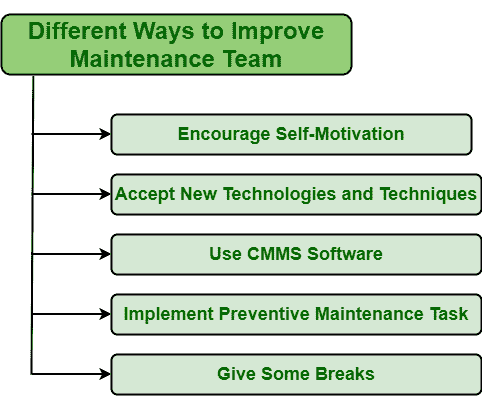

# 提升维修团队的不同方式

> 原文:[https://www . geeksforgeeks . org/不同方式改进维护团队/](https://www.geeksforgeeks.org/different-ways-to-improve-maintenance-team/)

**维护团队**，顾名思义，一般是有能力在[软件工程](https://www.geeksforgeeks.org/software-engineering/)中维护软件资产的团队。这些团队通常包括特定数量的人员或员工，他们作为一个团队一起工作，以提高软件资产、设备、设备部件、组件等的性能。

一个人应该具备清洁技能，即与修理和恢复资产、维护资产、设备等相关的清洁和维护技能。成为维护团队的一员。在每一个成功的设备和正常工作的设备背后，都有一个维护团队，负责处理和维护软件资产的状况和工作。

**提升维修团队的方法:**
有不同的方法可以让维修团队更有生产力和效率。其中一些如下:

1.  **Encourage Self-Motivation :**
    Self-Motivation is a very important and essential skill that helps individuals to take opportunities, show commitment, and develop determination to whatever they want to achieve, their work, complete various tasks, etc.

    自我激励的人知道自己的目标，因此会更加努力地寻找完成任务的不同方式。只有团队成员确切地知道他们必须做什么，才能激励和激励团队。管理者需要确保团队成员了解组织的愿景和主要目标。这只是有助于鼓励每个团队一起努力实现目标和更好的结果。管理者也可以利用一些策略和工具来激励团队成员。

2.  **接受新技术和技巧:**
    一个人应该总是试图找到解决任何旧问题的新方法，因为有时新方法比旧方法更能节省解决问题的金钱和时间。在组织中使用新技术只会提高生产率，增加销售额，并帮助维护团队做出更好、更快的决策。但是，如果新的工具或技术不能为组织增加价值和提供一些东西，那么就不应该实施这样的新技术。
3.  **使用 CMMS 软件:**
    [计算机化维护管理系统(CMMS)](https://www.geeksforgeeks.org/computerized-maintenance-management-systemcmms/) 是一种改进经理管理维护职能、团队、员工、活动等方式的管理系统。实施 CMMS 有助于改善团队成员之间的沟通。CMMS 连同预防性维护系统通常帮助维护团队为紧急情况做好准备。
4.  **Implement Preventive Maintenance Task :**
    One of best ways to improve maintenance team is to allow team members to start planning maintenance before any failures occur to simply prevent them from occurrence i.e. known as preventive maintenance and reduce doing repair after failure occurrence i.e. known as reactive maintenance or repairs.

    预防性维护有助于提高他们的思维水平、技能和管理能力。反应式维护压力更大，需要立即采取行动，并且不涉及任何计划。另一方面，预防性维护压力较小，防止资产故障，涉及规划，因此团队成员压力较小，工作效率更高，从而提高生产率。

5.  **给一些休息时间:**
    如果一个人不在工作时间表之间给团队成员提供休息时间，那只会影响团队的生产力、个人的心理健康以及团队的整体表现。休息是非常重要和必要的，因为它有助于减轻压力，有助于保持表现，提供一些能量，并为一天的其余时间充电。也增加了个人的工作满意度。