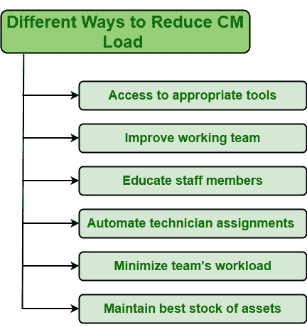

# 减少纠正性维护负荷的不同方式

> 原文:[https://www . geeksforgeeks . org/不同方式减少-纠正-维护-负荷/](https://www.geeksforgeeks.org/different-ways-to-reduce-corrective-maintenance-load/)

**纠正性维护(CM)** 是将特定故障资产恢复到其适当工作状态的一种方式。可以说，纠正性维护是一种通常执行的维护操作，而不是一个整体策略。对于不太重要或不太重要的资产，CM 是适当的维护措施，因为修复这些资产所需的成本较低，而不是试图执行预防措施。但是应该尽量减少维护操作的使用。可以通过以下不同方式最大限度地减少纠正性维护的数量:

1.  **获得合适的工具:**
    要执行维护操作，维修或更换资产所需的工具和资源的可用性非常重要。我们已经看到，在许多情况下，所有团队成员或工作人员都不被允许使用许多适合于纠正措施的工具。但是为了有效地执行，所有团队成员和工作人员都应该能够访问所有需要的工具。团队。因此，团队成员可以更快、更有效、更好地执行分配给他们的任务或维护任务，从而提高产品质量，减少生产所需的总时间。
2.  **改善工作团队:**
    在着手完成任何任务之前，你需要确保所有将要执行特定任务的成员都是高技能和训练有素的技术人员，能够应对任何类型的资产故障或故障。合格和训练有素的技术人员知道如何更快更有效地处理这种情况。如果团队成员技能不高，那么可以通过提供一些培训、额外的指导、分配日常任务等来增加团队的发展。团队成员也应该一起工作来减少 CM 负载。

*   **教育员工:**
    没有必要要求只有指定的团队成员应该了解特定的任务并能够识别潜在的维护故障。组织内所有成员的职责和责任是识别潜在故障并报告，以便更有效、更容易地执行维护操作。这也将使经理更容易将维护任务分配给能够以更好方式处理情况的适当团队成员或技术人员。*   **自动化技术人员分配:**
    故障可以有不同的类型。在组织内部，系统的任何部分都可能发生故障。它可以发生在设备、部件、设备的一部分、电路等。一个团队成员无法处理任何类型的失败。不同的团队成员或技术人员在他们不同的特定领域都有很高的技能和训练。因此，根据故障的性质，管理人员应该将特定的资产故障分配给适当的技术人员，他们可以更好、更有效地处理特定的问题，而不会出现任何问题。*   **最小化团队的工作量:**
    一个人需要确保团队成员不应该有任何工作量，因为这会降低他们表现良好的能力和更多犯错的机会。因此，需要执行的每项任务都应该根据数据分析、任务的严重性和重要性来安排。对日程安排的需求只是有助于确定任务的优先级，并帮助团队成员在没有任何负载的情况下根据优先级无任务地工作。*   **保持最佳资产存量:**
    需要确保工具、资源、设备部件或资产的可用性，以备将来参考。所有这些股票都应该装备精良，最好。如果出现任何故障，都需要立即购买这些股票。如果所需的零件可用，则不必等待所需的特定零件来纠正故障设备并将其恢复到正常工作状态。