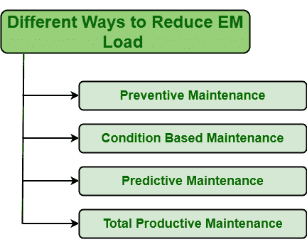

# 降低应急维护负荷的不同方式

> 原文:[https://www . geesforgeks . org/异途-降低-紧急-维护-负荷/](https://www.geeksforgeeks.org/different-ways-to-reduce-emergency-maintenance-load/)

首先，需要了解**紧急维修**到底是什么意思？每当任何资产或设备的任何正常功能或操作因意外故障或故障而中断时，这些意外故障会对资产以及整个系统造成损害。要求立即采取行动，防止事态恶化，影响生产、员工安全、组织职能等。

紧急维护仅包括团队成员的协调，以及故障或故障后的设备维修，无论其原因如何。导致紧急维护的主要原因可以永久消除或解决，但人们可以尝试减少其影响以及与之相关的其他风险或故障发生的机会。

**方法:**
有几种方法可以帮助减少应急维护的负荷。其中，最好的方法之一是实施主动维护策略。这种主动维护策略通常会识别潜在故障，然后在此类紧急故障转化为无法控制的重大问题之前解决。如今，有许多主动维护策略可用。人们可以根据自己的环境、情况、预算等选择最合适的。可以实施的不同主动维护策略如下所示:

1.  **预防性维护:**
    预防性维护是一种旨在保持资产不间断运行的维护策略。为了实现这一目标，预防性维护需要定期检查和维护资产。这种维护只是防止资产意外故障或崩溃。
2.  **基于条件的维护(CBM) :**
    CBM 是一种维护策略，旨在保持资产不间断运行，但仅在需要时才运行。此类维护仅根据设备的当前状况以及是否需要维护来执行。这种维护简单地避免了不必要的维护，节省了资金。
3.  **预测性维护(PdM) :**
    PdM 是一种维护策略，旨在保持资产正常运行，没有任何中断，只需预测资产何时可能出现故障或损坏，以便采取维护措施来防止故障发生。这种类型的维护仅在有可能发生故障时进行。它依靠状态监测设备来实时检查设备的状态。
4.  **Total Productive Maintenance (TPM) :**
    Tdm is a maintenance strategy that aims at keeping assets up and running without any interruption as wells as improving condition of assets also. It simply focuses on achieving perfect production and increasing equipment effectiveness.

    **其他减少 EM 工作量的方式:**

    *   应该选择经过适当培训的技术人员和专家来执行生产工作。
    *   人们应该使用最合适和最需要的工具和资源。
    *   向员工提供关于设备工作的全部信息。