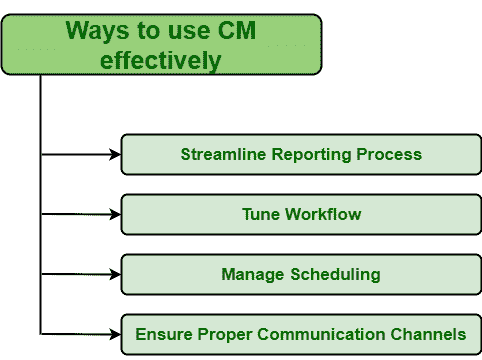

# 有效使用 CM 的不同方式

> 原文:[https://www . geesforgeks . org/differential-to-use-cm-effective/](https://www.geeksforgeeks.org/different-ways-to-use-cm-effectively/)

**[纠正性维护(CM)](https://www.geeksforgeeks.org/corrective-maintenance-cm/)** ，是通常为维修或更换故障资产(设备、部件、设备零件等)而进行的维护动作。).在这种情况下，不会对允许运行直至出现故障的资产执行任何预防或预防措施。这种维护或纠正措施通常适用于由于严重性较低而处于低优先级的设备，以及没有这些设备，操作可以不间断地继续进行。这也适用于价值较低的资产，即恢复或替换此类资产证明比维护和防止其故障更便宜。有效地管理 CM 仅仅意味着:

*   使用执行 CM 所需的最少数量的工具和资源。
*   使用更少的劳动力或成员来执行 CM。
*   以高效的方式更快地实施 CM。
*   团队成员可以访问所有必需的工具和所有必要的信息，例如关于问题、以前的故障、资产历史等的信息。
*   允许所有成员报告问题。
*   团队成员工作高效，相互沟通良好。
*   训练有素的技术人员的可用性。

**更有效地执行 CM 的方法:**
有不同的方法可以更有效地执行 CM。计算机化维护管理系统(CMMS)也支持这些方式，如下所示:

1.  **简化报告流程:**
    简化报告流程是一种保持组织向前发展并提供所有所需信息的流程。它只是保持数据的安全和准确。所有流程通常都旨在简化团队成员的工作方式。一个人需要确保所有的纠正措施都得到正确的处理。为了正确地解决纠正措施，组织内的每个成员都应该被允许并且有一个简单的方法来报告任何问题。汇报后，由管理团队负责监督和管理。因此，也应该为他们提供一种简单的工作方式。简化报告流程可以让用户遵循一系列步骤，从而减少失败，减少工作量，并让客户感到更加满意。如果没有实施简化的报告流程，可能会出现如下问题:

*   团队成员可能会感到沮丧。
*   成本可能会增加。
*   资源也浪费了。
*   顾客可能会抱怨产品质量差或服务差。
*   工作可能未完成或未完成。

*   **Tune Workflow :**

    人们需要通过提高加工速度来保持产品质量。每个将要参加 CM 表演的人都应该知道他们应该做什么，并且应该有关于他们工作的全部信息。这将加快他们的工作，进而提高产量。

    *   **管理调度:**
    运行良好、部门维护良好的组织，这类组织有明确的维护策略，通过调度整体维护任务，以高效的方式工作。有几个纠正措施需要立即执行，其中一些可以稍后执行。根据问题的严重程度，将优先考虑并安排纠正措施。为了安排纠正措施，需要记住以下几点:
    *   已经在进行的纠正措施
    *   需要执行的纠正措施。
    *   谁将执行特定的纠正措施？
    *   谁是其他技术人员，可以执行其他预定的纠正措施和时间？*   **确保适当的沟通渠道:**
    将要执行特定任务的人应该了解他们的工作。所有成员都将对资产执行纠正措施，这些措施应根据维护工作的进度进行更新。即使是不处理资产的成员也应该了解工作。为此，所有成员之间应该有适当的沟通。每个人都应该知道什么是问题，以及解决问题所需的时间。