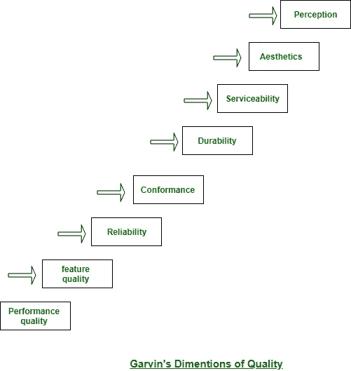

# 软件质量维度|加文质量维度

> 原文:[https://www . geesforgeks . org/dimension-of-software-quality-garvins-dimensions-of-quality/](https://www.geeksforgeeks.org/dimension-of-software-quality-garvins-dimensions-of-quality/)

大卫·加文建议，应该从第三维的阅读角度来思考质量，从评估一致性开始，以先验(美学)观点结束。尽管 Garvin 的 8 个质量维度并不是专门为软件系统开发的，但是一旦考虑到软件系统质量，它们就会被应用。

产品质量管理的八个维度将在战略层面上用于调查质量特征。这个想法是由哈佛大学研究生院工商管理学院前院士大卫·加文(2017 年阳历三十月去世)提出的。

一些尺度是相互加强的，而另一些似乎不是，一个尺度的改善也是以牺牲其他尺度为代价的。了解客户在这些方面需要的权衡将有助于建立竞争优势。

Garvin 的八个维度总结如下:

1.  **性能质量:**
    软件系统是否会在给小费用户带来价值的方法中交付所有内容、功能和选项，例如必需品模型的一部分？
2.  **功能质量:**
    软件系统是否提供让首次完成的用户惊喜和愉悦的选项？
3.  **可靠性:**
    软件系统会提供所有选项和能力而不出现故障吗？
    一旦需要就能得到吗？
    它会提供没有错误的实用性吗？
4.  **一致性:**
    软件系统会调整到与应用相关的本地和外部软件标准吗？
    是否符合事实风格和写作惯例？举例来说，计算机程序在菜单选择或知识输入方面是否符合公认的风格规则？
5.  **持久性:**
    软件系统会被维护(变更)或修正(调试)而不会意外产生无意的小面效应吗？变更会导致错误率或责任随着时间而降低吗？
6.  **Serviceability:**
    Will the software system be maintained (changed) or corrected (debugged) in a tolerably short time period?
    Will support employees acquire all data they have to create changes or correct defects?

    斯蒂芬·a·道格拉斯·亚当斯做了一个看起来可以接受的讽刺评论:“一件可能出错的事情和一件不可能出错的事情之间的区别在于，一旦不可能出错的事情出错，似乎总是无法催促或修复。”

7.  **美学:**
    毫无疑问，每一个民间都包含着对什么是美学的完全不同的、真正主观的看法。
    然而，大多数人会同意，审美实体包括一个确定的类别、一个新颖的流程和一个清晰的“存在”，这些很难量化，但仍然很明显。美学软件系统具有这些特点。
8.  **Perception:**
    In some things, you’ve got a collection of prejudices which will influence your perception of quality. as an example, if you’re introduced to a software product that was engineered by a seller United Nations agency has created poor quality within the past, your guard is raised and your perception of the present software product quality may be influenced negatively.

    同样，如果一个卖家有一个很棒的名字，你就会明白质量，即使它曾经不太存在。

加文质量的八个维度的图解形式:

Garvin 的质量维度为您提供了软件系统质量的“软”审视。这些维度中的几个(但不是全部)将被主观地思考。因此，您可能还需要一组“硬”质量因素，可分为两大类:

*   可以直接测量的因素(例如，测试期间发现的缺陷)。
*   可以单独间接测量的因素(例如可用性或可维护性)。
    在任何情况下，都应该发生活动。你应该将软件系统与一些信息进行比较，并获得质量的标志。