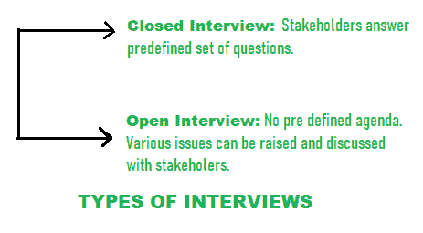
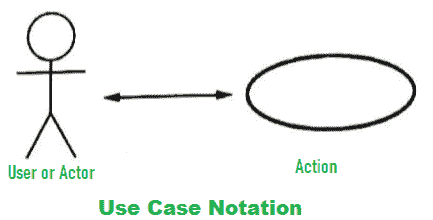
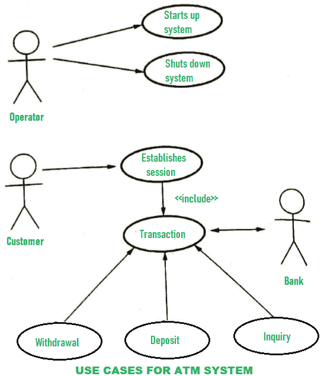

# 需求收集的尺寸

> 原文:[https://www . geeksforgeeks . org/需求收集维度/](https://www.geeksforgeeks.org/dimensions-of-requirement-gathering/)

需求收集是需求发现或生成需求列表或由涉众收集尽可能多的需求的过程。它也被称为需求获取或需求捕获。

需求集合的各种**尺寸为:**

1.  **利益相关者–**
    利益相关者是指对项目结果感兴趣或关注的受系统影响的人。
    例如:最终用户、系统维护工程师或管理员、软件开发人员、直接用户、间接用户、高级经理等。通过收集这些涉众的需求，理解系统需求变得非常容易。
2.  **面试–**
    面试是收集需求的重要且非常有效的方法。需求工程团队向涉众提出了关于系统及其使用的不同问题，以便使用这些答案来识别需求。面试官有两种类型:

面试官有助于理解利益相关者，但对理解应用领域没有多大帮助。

*   **Use Case Modeling –**
    Use cases are fundamental units of modeling language, in which functionalities are distinctly presented. The use case is scenario-based technique. Individual interactions with system can be identified using or with help of Use case model. Using of use case model is extremely done for requirements gathering. Important system requirements can be traced or identified by designing proper use cases for different scenarios. In use cases, typical notations used are:

    

    自动柜员机系统的使用案例如下所示:

    

    *   **设施应用规范技术(FAST)–**
    设施应用规范技术是一种方法，在这种方法中，客户和开发人员的联合团队一起工作，以识别问题，提出解决方案的要素，协商不同的方法，并为初步的解决方案需求集准备规范。准备-每次 FAST 会议中，都会询问每位 FAST 与会者对象列表、服务列表和约束列表。成本、规则、内存需求、速度精度等系统约束。在约束列表中提到。一旦 FAST 会议开始，新产品的需求和理由就是讨论的第一个问题。一旦每个人都同意产品是合理的，每个参与者都必须提交他的清单。