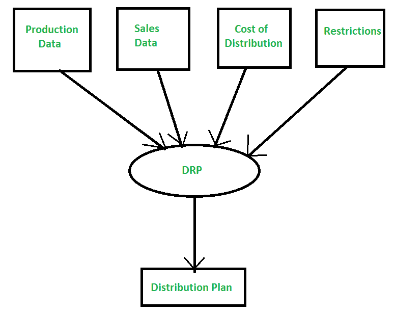

# 配送需求计划(DRP)

> 原文:[https://www . geesforgeks . org/distribution-requirement-planning-DRP/](https://www.geeksforgeeks.org/distribution-requirement-planning-drp/)

是[物料需求计划](https://www.geeksforgeeks.org/evolution-of-erp-system/)的延伸。这是一个通过确定货物的数量和更需要货物的地点来提高交货效率的过程。基本上是 MRP 原理在配送环境中的应用，整合了配送的特殊需求。

公司利用它来确保在适当的时间和地点获得适当数量的材料。它采用分时段的计划，以确保最终产品的及时生产。灾难恢复计划的关键要素是:

1.  需要
2.  当前库存水平
3.  目标安全库存
4.  数量
5.  补货提前期。

**优势:**

*   可靠性的提高
*   有可能用未来的订单来完成订单，从而产生满载的卡车。
*   它可以更改为商店级别的需求预测。
*   DRP 还能够预测该领域的未来需求。
*   客户服务增强。
*   成本意识。

**缺点:**

*   预测维护
*   它只在商店级别保持精确的 PI。
*   如果在商店一级出现不准确，将导致仓库的噪音增加。