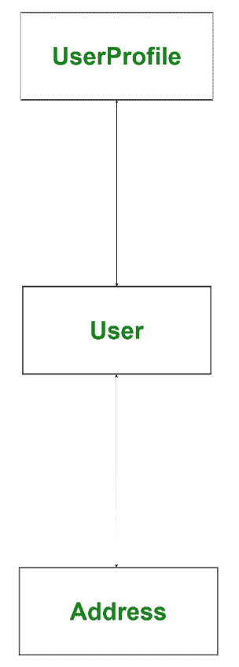
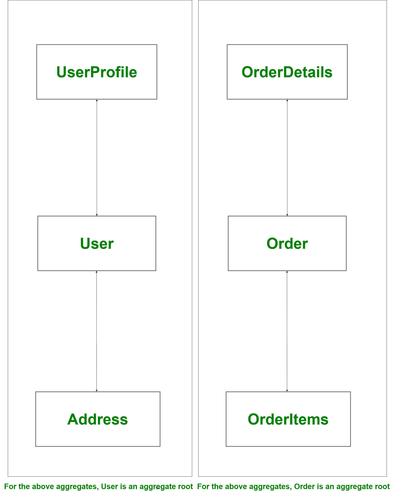

# 领域驱动设计(DDD)

> 原文:[https://www.geeksforgeeks.org/domain-driven-design-ddd/](https://www.geeksforgeeks.org/domain-driven-design-ddd/)

领域驱动设计是程序员埃里克·埃文斯在 2004 年的著作《T2:解决软件核心的复杂性》中提出的一个概念。

这是一种通过自上而下的方法来设计软件的方法。在详细讨论这个话题之前，让我们试着集中一些注意力，理解在这种情况下，域是什么意思。

**什么是域？**
软件开发上下文中使用的“域”一词指的是*业务*。在应用程序开发过程中，通常使用术语领域逻辑或业务逻辑。基本上，业务逻辑是应用程序逻辑所围绕的知识领域。应用程序的业务逻辑是一组规则和指导方针，解释业务对象应该如何相互交互来处理建模的数据。

**注–**
软件工程领域的一个领域就是应用程序要构建的业务。

**领域驱动设计:**
假设我们已经使用所有最新的技术堆栈和基础设施设计了软件，我们的软件设计架构非常棒，但是当我们在市场上发布这个软件时，最终是最终用户决定我们的系统是否棒。同样，如果系统不能解决业务需求，对任何人都没有用；不管它看起来有多漂亮，基础设施的架构有多好。根据埃里克·埃文斯的说法，当我们开发软件时，我们的重点不应该主要放在技术上，而应该主要放在商业上。记住，

> 客户的工作不是知道他们想要什么”——史蒂夫·乔布斯

领域驱动设计讲两种设计工具，第一种是战略设计工具，第二种是战术设计工具。程序员或开发人员通常处理战术设计工具，但是如果我们有知识并且对战略设计工具有很好的理解，那么它将帮助我们设计好的软件。

Spring 数据族下的大多数框架都是考虑领域驱动的设计方法而构建的。

**战略设计:**
战略设计工具帮助我们解决所有与软件建模相关的问题。这是一种类似于面向对象设计的设计方法，在面向对象设计中，我们被迫从对象的角度进行思考。因此，战略设计迫使我们从一个背景来思考。

**上下文:**
我们可以认为这是一个英语单词，指的是一个事件、事件、陈述或想法的情况，根据这些情况可以确定它的意思。
除了语境，战略设计还讲模型、泛在语言、有界语境。这些是领域驱动设计的战略设计中常用的术语。让我们一个一个了解。

*   **模型–**
    它充当核心逻辑，描述领域的选定方面。它用于解决与该业务相关的问题。
*   **泛在语言–**
    所有团队成员使用的通用语言，用于围绕领域模型连接团队的所有活动。就像在与领域专家和团队成员交谈时，对类、方法、服务和对象使用常见的动词和名词一样。

*   **Bounded Context –**
    It refers to boundary conditions of context. It is a description of a boundary and acts as a threshold within which, a particular domain model is defined and applicable.

    **战术设计:**
    战术设计讲的是实现细节，即建模域。它通常负责有界上下文中的组件。我们可能听说过或使用过像服务、实体、存储库和工厂这样的东西。它们都是由领域驱动设计创造并流行起来的。战术设计过程发生在产品开发阶段。

    让我们讨论一些重要的战术设计工具。这些工具是高级概念，可用于创建和修改领域模型。

    1.  **实体–**
        一个从事面向对象原理工作的程序员可能知道类和对象的概念。在这里，实体是具有某些属性的类。这些类的实例具有全局标识，并且在整个生命周期中保持相同的标识。请记住，财产状况可能会发生变化，但身份永远不会改变。简而言之，一个实体实现了一些业务逻辑，并且可以使用一个标识来唯一标识。在编程环境中，它通常作为一行保存在数据库中，并由值对象组成。
    2.  **Value Objects –**
        These are immutable, light-weight objects that don’t have any identity. Value objects reduce complexity by performing complex calculations, isolating heavy computational logic from entities.

        

        上图中*用户*为实体，*地址*为取值对象，地址可以多次改变，但用户身份不变。每当地址发生变化时，新地址将被实例化并分配给用户。

    3.  **服务–**
        服务是一个无状态类，适合实体或值对象之外的其他地方。简而言之，服务是存在于实体和值对象之间的功能，但它既不与实体相关，也不与值对象相关。
    4.  **Aggregates –**
        When we have bigger project, object graph becomes big, The bigger object graph harder it is to maintain it. An aggregate is a collection of entities and values which come under a single transaction boundary. Aggregates basically, control change and have a root entity called aggregate roots. The root entity governs lifetime of other entities in aggregates.

        

        在上面的例子中，如果根实体*用户*或*订单*被删除，与根实体相关联的其他实体将没有用，并且该相关信息也将被删除。这意味着聚合本质上总是一致的，这是借助于域事件来完成的。生成域事件是为了确保最终的一致性。
        在上面的例子中，如果用户的地址已经改变，那么它也必须反映在订单中。为此，我们可以从用户到订单触发一个域事件，以便订单更新地址，这样我们就有了最终的一致性，订单也将最终保持一致。

        聚合和聚合根的其他示例可以是帖子评论、问答详细信息、银行交易详细信息等。像**休眠**这样的 ORM 工具在创建一对多或多对一关系时会大量使用聚合。

    5.  **工厂和仓库–**
        工厂和仓库用于处理聚合。工厂有助于管理聚合生命周期的开始，而存储库有助于管理聚合生命周期的中期和末期。工厂有助于创建聚合，而存储库有助于持久化聚合。我们应该总是为每个聚合根创建一个存储库，但不是为所有实体。

工厂是来自 GoF 的设计模式，工厂是有用的，但在聚合规则的上下文中不是强制性的。

**领域驱动设计的优势:**

*   它改进了我们的工艺。
*   它提供了灵活性
*   与接口相比，它更喜欢域
*   它通过泛在语言减少了团队之间的沟通差距

**领域驱动设计的缺点:**

*   它需要一个专业人士谁拥有强大的领域专业知识
*   它鼓励团队遵循迭代实践