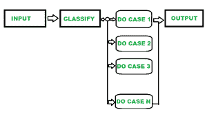

# 软件工程中的领域测试

> 原文:[https://www . geesforgeks . org/domain-testing-in-software-engineering/](https://www.geeksforgeeks.org/domain-testing-in-software-engineering/)

每个软件开发过程都遵循[软件开发生命周期(SDLC)](https://www.geeksforgeeks.org/software-development-life-cycle-sdlc/) 最终开发出高质量的软件产品。其中[软件测试](https://www.geeksforgeeks.org/software-testing-basics/)是重要阶段之一，因为它只保证产品的质量。因此，执行不同类型的软件测试来检查不同的参数或测试用例。

**域测试:**
这是一种软件测试技术，使用最小数量的输入来访问系统的适当输出，以确保系统不接受无效的输入值。期望系统给出所需的输出，阻止无效的输入。

**领域测试的结构:**
当涉及到构建策略时，该过程在任何地方都非常相似，其中使用了以下适合大多数场景的逐步结构:

*   想想会出什么问题。
*   找到解决每个案例的方法。
*   选择几个点来测试每个错误。
*   取一个测试点来检查相邻的域
*   然后开始运行测试
*   检查边界是否有缺陷
*   检查所有域的边界

**领域知识:**
领域知识是对特定领域的良好理解，即一个人熟悉特定的学科术语。它有助于最大限度地缩短交付周期，改善客户服务，减少开发时间。

**领域测试需要领域知识吗？**
在一个人不熟悉的领域，一个人很难有效地表现。所以一个领域测试人员应该要有基本的领域知识。这很重要，因为:

*   **网银–**
    测试人员必须是登录、账单支付、转账等网银活动的专家。
*   **零售领域–**
    要成功运行一个领域测试，测试人员必须认识到事物是如何在不同的层次上流动的。零售领域的一些例子是仓库管理、店内解决方案等。
*   **医疗保健–**
    对领域知识有适当理解的测试人员应该处理医疗保健系统。零知识的人处理系统，对某人的生命是巨大的风险。

**领域测试策略:**
我们知道每个领域都有一个定义它的边界，边界附近的点会在测试中被检查。每次测试过程都是从一个问题开始的。领域测试策略是由质量保证专家进行的一项实验，旨在找到这些答案的解决方案:

*   应该测试哪个领域？
*   如何将值分组到类中？
*   我应该测试什么价值？
*   我要怎么得到结果？

**领域测试的真实例子:**
让一群学生在游学。出于娱乐目的，他们获得了一张票，可以根据性别和年龄进行特定的活动。这里娱乐设施作为测试，年龄组将是有许多可能的场景的边界值。学生以下列方式进行活动:

*   不到 5 岁的孩子会讲一首诗
*   男生 5>=10 要画画
*   女孩 5>=10 要唱一首歌
*   10 岁以上的男孩将参加一项运动
*   10 岁以上的女孩将参加测验
*   剩下的 15 岁以上的孩子将参加作文比赛

在给定算法的基础上，专家将值分组为类，即年龄组，然后选择边界值，即组中的最高和最低年龄值。然后构建不同的场景，每个场景都有预期的结果。

**领域测试所需技能:**
要成为一名优秀的领域测试人员，必须具备以下技能:

*   快速学习者
*   领域知识
*   能在压力下工作
*   技术和编程技能
*   自动化技能
*   猎虫技巧
*   沟通技巧

领域测试需要提供正确输入的知识来获得必要的输出。它也相当于边界分析测试，其中输入变量被检查并作为边界值和等价类值以获得期望的结果。