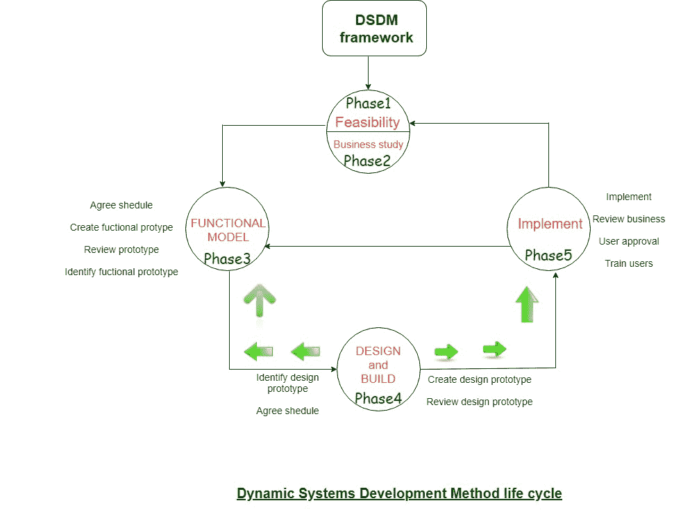

# 动态系统开发方法(DSDM)

> 原文:[https://www . geesforgeks . org/dynamic-systems-development-method-dsdm/](https://www.geeksforgeeks.org/dynamic-systems-development-method-dsdm/)

**动态系统开发技术(DSDM)** 是一种大专学历的敏捷代码开发方法，它为构建和维护系统提供了一个框架。DSDM 哲学借鉴了社会学家原理的一个修改版本——一个应用程序的 80 %通常是在它希望交付整个(100%)应用程序的 20%的时间内交付的。

DSDM 是一种迭代代码方法，在这种方法中，每次迭代都遵循 80%的规则，也就是说，每次增量都需要足够的工作，以便于移动到下一个增量。一旦注意到大量的业务需求，或者要求并适应了变更，剩下的细节通常会在稍后完成。

DSDM 工具(www.dsdm.org)可以是一个全球性的成员公司集群，共同解决战略“守护者”的角色。该资源库概述了敏捷开发模型，即 DSDM 生命周期，它定义了 3 个不同的不变周期，在此之前还有 2 个生命周期活动:

1.  **可行性研究:**
    它确定了与要设计的应用程序相关的基本业务需求和限制，然后评估该应用程序是否可以作为 DSDM 方法的可行候选。
2.  **商业研究:**
    它确立了可能允许申请提供商业价值的用途和知识必需品；此外，它是基本的应用程序设计，并确定了应用程序的可维护性需求。

*   **功能模型迭代:**
    它产生了一个渐进原型的集合，为客户展示了实用性。
    (注:所有 DSDM 原型都应该发展成可交付应用。)在这个不变的循环中，意图是通过在用户练习范例时从他们那里获得反馈来收集更多的必需品。*   **设计和构建迭代:**
    它重新审视在整个有用的模型迭代中设计的原型，以确保每个人都是以一种可能改变它的方式被设计的，从而为最终用户提供可操作的业务价格。在某些情况下，有用的模型迭代以及样式和构建迭代同时发生。*   **Implementation:**
    It places the newest code increment (an “operationalized” prototype) into the operational surroundings. It ought to be noted that:
    *   **(a)** 增量可能没有 100%完成，
    *   **(b)** 也要求更改，因为增量已到位。在这两种情况下，DSDM 的开发工作都通过返回到有用的模型迭代活动来继续。

    下图描述了 DSDM 的生命周期:

    

    DSDM 经常与极限编程相结合，提供一种混合的方法，定义了一个坚实的方法模型(DSDM 生命周期)，以及创建代码增量所需的愚蠢和草率的实践(极限编程)。此外，协作和自组织小组的 ASD 思想通常是为组合方法模型量身定制的。