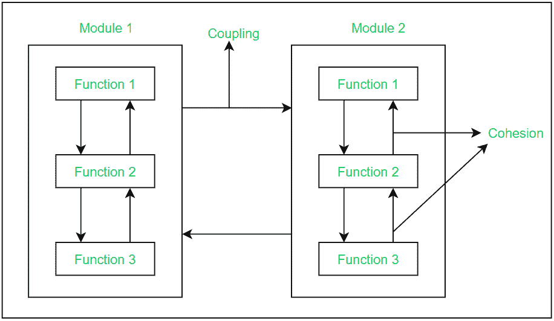

# 软件工程中有效的模块化设计

> 原文:[https://www . geesforgeks . org/effect-模块化软件工程设计/](https://www.geeksforgeeks.org/effective-modular-design-in-software-engineering/)

**有效的模块化设计在软件工程中的作用:**
任何软件都由许多包含若干子系统的系统组成，而这些子系统又包含它们的子系统。因此，一次设计一个完整的系统，包括每一个所需的功能，是一项繁重的工作，并且由于其庞大的规模，该过程可能会有许多错误。

因此，为了解决这个问题，开发团队将整个软件分解成不同的模块。模块被定义为软件的唯一和可寻址的组件，这些组件可以被独立地解决和修改，而不会干扰(或影响很小)软件的其他模块。因此，每个软件设计都应该遵循模块化。

将一个软件分解成多个独立的模块，每个模块单独开发的过程称为**模块化**。

如果划分的模块是可分别解析的、可修改的以及可编译的，则可以实现有效的模块化设计。这里，独立的可编译模块意味着在模块中进行更改后，不需要重新编译整个软件系统。

为了构建一个有效的模块化设计的软件，有一个因素**“功能独立性”**发挥作用。功能独立性的含义是，一个功能本质上是原子的，因此它只执行软件的一个任务，而不与其他模块交互，或者与其他模块交互最少。功能独立性被认为是模块化发展的标志，即较大功能独立性的存在导致软件系统设计良好，设计进一步影响软件质量。

**软件设计中独立模块/功能的好处:**
由于软件的功能被分解为原子级别，因此开发人员对每个功能都有明确的要求，因此软件设计变得容易且无错误。

由于模块是独立的，因此它们对其他模块的依赖性有限，或者几乎没有依赖性。因此，在不影响整个系统的情况下对模块进行更改在这种方法中是可能的。
可以忽略从一个模块到另一个模块以及整个系统中的误差传播，这在测试和调试期间节省了时间。

软件系统模块的独立性可以用两个标准来衡量:[内聚性，和](https://www.geeksforgeeks.org/software-engineering-coupling-and-cohesion/)耦合性。这些解释如下。



<center>**Figure –** Cohesion and Coupling between 2 modules</center>

**内聚性:**
内聚性是模块内各种功能之间关系强度的度量。它有 7 种类型，按内聚性从高到低的顺序列出如下:

```
1. Functional cohesion
2. Sequential cohesion
3. Communicational cohesion
4. Procedural cohesion
5. Temporal cohesion
6. Logical cohesion
7. Co-incidental cohesion 
```

**耦合:**
耦合是软件内各种模块之间关系强度的度量。它有 6 种类型，按低耦合到高耦合的顺序列出如下:

```
1. Data Coupling
2. Stamp Coupling
3. Control Coupling
4. External Coupling
5. Common Coupling
6. Content Coupling 
```

> 一个好的软件设计需要**高内聚**和**低耦合**。