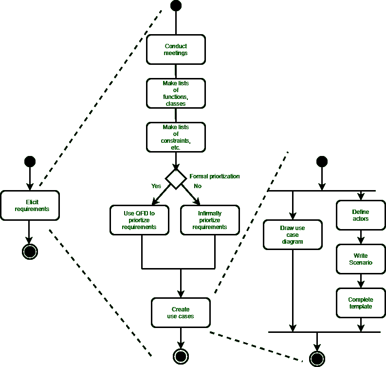
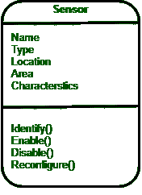
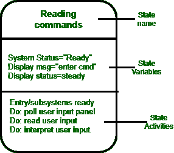

# 需求模型的要素

> 原文:[https://www . geesforgeks . org/elements-of-of-the-requirements-model/](https://www.geeksforgeeks.org/elements-of-the-requirements-model/)

对基于计算机的系统的要求可以从许多不同的方面来看。一些软件人员认为使用多种不同的表示模式是值得的，而其他人认为最好选择一种表示模式。

需求模型的具体**元素专用于将要使用的分析建模方法。**

*   **基于场景的元素:**
    使用基于场景的方法，从用户的角度描述系统。**例如**，基本用例及其对应的用例图演变成更精细的基于模板的用例。图 1(a)描述了一个 UML 活动图，用于引出需求并使用用例来表示它们。有三个层次的阐述。
*   **基于类的元素:**
    具有相似属性和共同行为的事物的集合，即对象被分类为类。**例如**，一个 UML 用例图可以用来描述安全之家安全功能的传感器类。请注意，图表列出了传感器的属性和可用于修改这些属性的操作。除了类图，其他分析建模元素描述了类之间相互协作的方式以及类之间的关系和交互。

*   **Behavioral elements :**
    Effect of behavior of computer-based system can be seen on design that is chosen and implementation approach that is applied. Modeling elements that depict behavior must be provided by requirements model.

    图 1(a):引出需求的 UML 活动图

    

    传感器类图

    通过描述导致系统改变状态的状态和事件来表示系统行为的方法是状态图。状态是一种外部可观察的行为模式。此外，状态图指示作为特定事件的结果而采取的动作。

    为了说明状态图的使用，考虑嵌入在 safeHome 控制面板中负责读取用户输入的软件。简化的 UML 状态图如图 2 所示。

    

    图 2: UML 状态图符号

    *   **面向流动的元素:**
    当信息流经基于计算机的系统时，信息被转换。系统接受输入，应用函数对其进行转换，并以各种形式产生输出。输入可以是由传感器传输的控制信号、由操作员键入的一系列数字、在网络链路上传输的信息包或从二级存储器检索的大量数据文件。转换可能会损害单个逻辑比较、复杂的数字算法或专家系统的规则推理方法。输出产生一份 200 页的报告或可能点亮一个发光二极管。实际上，我们可以为任何基于计算机的系统创建一个流程模型，无论其大小和复杂性如何。