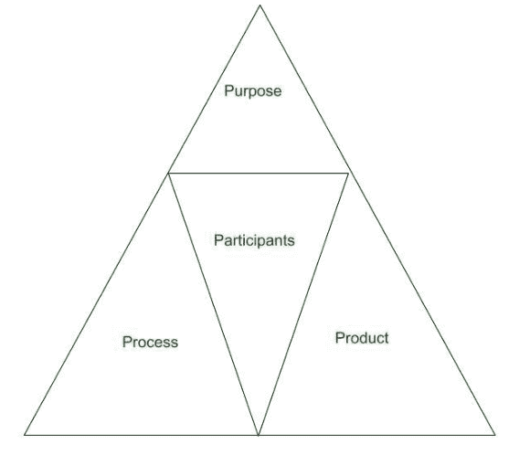

# 软件工程中的实证研究

> 原文:[https://www . geeksforgeeks . org/软件工程实证研究/](https://www.geeksforgeeks.org/empirical-research-in-software-engineering/)

**经验研究**被定义为任何研究或研究，其中研究的结论是从可验证的具体经验证据中精确得出的。实证研究旨在使用统计检验技术来检验假设，从而缩小理论和实践之间的差距。

**实证研究的重要性:**
它有助于改进、分析和评估软件开发的程序和过程。它也提供了决策的指导方针。实证研究对不同场景下的研究者、学者和软件行业都是有用的。

1.  **Software Industry:**
    Empirical Study can be used to answer the questions related to industrial practices and can improve the strategies and methods of software development. The predictive models built in Empirical Research can be implemented in similar industrial applications in near future. The empirical research allows software developers to apply the results of the experiment and ascertain that set of good procedures and processes are followed at some point of software development. Thus, the empirical research guides towards determining the best of the resultant software processes and products.
2.  **Researchers:**
    According to researchers, the results can be used to provide information about existing guidelines and trends regarding future research. Empirical study is useful in establishing the generalizability of results related to new subjects or data sets by researchers.

3.  **院士:**
    实证研究通过采访不同的利益相关者、进行科学实验或进行调查，帮助院士找到问题的答案。院士以假设的形式进行预测。在实证研究的帮助下，这些假设可以得到检验，它们的结果可以显示为被接受或被拒绝。因此，院士们可以根据结果对某一特定的理论作出结论或作出某种概括。

**实证研究基本要素:**

1.  **Purpose:**
    The purpose states the objective of the research, specific motives in the form of research questions, relevance topics and reason of research.
2.  **Process:**
    Process gives a detailed sequence of steps need to be taken to conduct a research. It provides a method in which the research will be conducted. It provides details about the methodologies, techniques and procedures to be used in the research.
3.  **Participants:**
    Participants are those persons which are involved in the research as subjects. They are closely interviewed to obtain the research results. Ethical issues in Empirical research must be considered when dealing with participants so that they don’t get harmed in any way.
4.  **产品:**
    研究成果产生产品。实证研究的最终结果提供了研究问题的答案。任何新的技术或方法都可以被认为是实证研究的产物。很少的例子是会议文章，期刊论文，论文，技术报告。